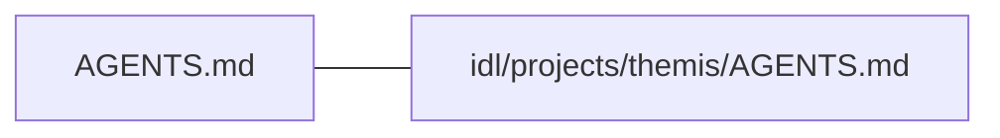
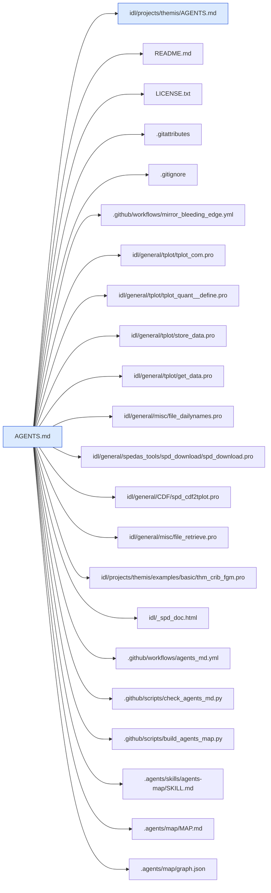
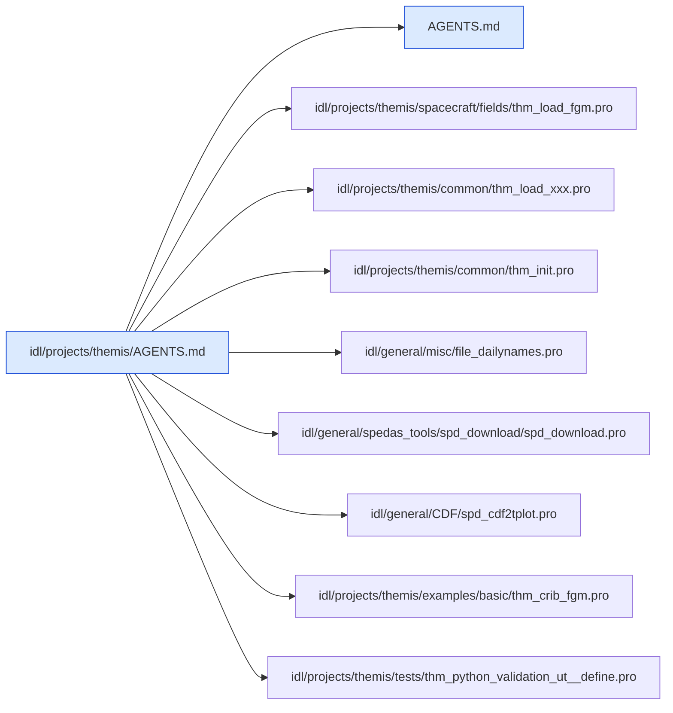

# AGENTS.md map

Generated by `.github/scripts/build_agents_map.py` from the `related_files` headers of every AGENTS.md.
Don't edit it by hand; rebuild it as described in `.agents/skills/agents-map/SKILL.md`.

2 AGENTS.md file(s) listing 31 related path(s), 0 of them missing.

## AGENTS.md links

A line joins two AGENTS.md files when either lists the other.

## Paths listed by more than one AGENTS.md

| Path | Listed by |
| --- | --- |
| `idl/general/CDF/spd_cdf2tplot.pro` | `AGENTS.md`, `idl/projects/themis/AGENTS.md` |
| `idl/general/misc/file_dailynames.pro` | `AGENTS.md`, `idl/projects/themis/AGENTS.md` |
| `idl/general/spedas_tools/spd_download/spd_download.pro` | `AGENTS.md`, `idl/projects/themis/AGENTS.md` |
| `idl/projects/themis/examples/basic/thm_crib_fgm.pro` | `AGENTS.md`, `idl/projects/themis/AGENTS.md` |

## `AGENTS.md`

Parent: none. Children: `idl/projects/themis/AGENTS.md`.

## `idl/projects/themis/AGENTS.md`

Parent: `AGENTS.md`. Children: none.

