# AGENTS.md map

Generated by `agents/scripts/build_agents_map.py` from the `related_files` headers of every AGENTS.md.
Don't edit it by hand; rebuild it as described in `agents/skills/agents-map/SKILL.md`.

60 AGENTS.md file(s) listing 1756 related path(s), 0 of them missing.

## AGENTS.md links

A line joins two AGENTS.md files when either lists the other.

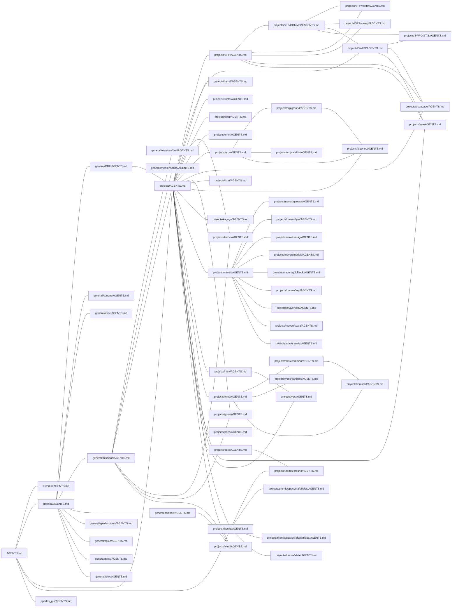

## Paths listed by more than one AGENTS.md

| Path | Listed by |
| --- | --- |
| `external/IDL_ICY/README.txt` | `external/AGENTS.md`, `general/spice/AGENTS.md` |
| `external/astron/fits/mrdfits.pro` | `external/AGENTS.md`, `projects/emm/AGENTS.md` |
| `external/spdfssc/spdfgetlocations.pro` | `external/AGENTS.md`, `projects/goes/AGENTS.md` |
| `general/CDF/cdf2tplot.pro` | `general/AGENTS.md`, `general/CDF/AGENTS.md`, `general/missions/AGENTS.md`, `general/missions/fast/AGENTS.md`, `general/missions/rbsp/AGENTS.md`, `projects/AGENTS.md`, `projects/SPP/fields/AGENTS.md`, `projects/barrel/AGENTS.md`, `projects/dscovr/AGENTS.md`, `projects/erg/AGENTS.md`, `projects/erg/ground/AGENTS.md`, `projects/erg/satellite/AGENTS.md`, `projects/escapade/AGENTS.md`, `projects/poes/AGENTS.md` |
| `general/CDF/spd_cdf2tplot.pro` | `AGENTS.md`, `general/AGENTS.md`, `general/CDF/AGENTS.md`, `general/missions/rbsp/AGENTS.md`, `general/spedas_tools/AGENTS.md`, `projects/AGENTS.md`, `projects/cluster/AGENTS.md`, `projects/elfin/AGENTS.md`, `projects/mms/AGENTS.md`, `projects/mms/common/AGENTS.md`, `projects/themis/AGENTS.md` |
| `general/CDF/tplot2cdf.pro` | `general/CDF/AGENTS.md`, `general/spedas_tools/AGENTS.md` |
| `general/CDF/tplot_add_cdf_structure.pro` | `general/CDF/AGENTS.md`, `general/spedas_tools/AGENTS.md` |
| `general/cotrans/aacgm/aacgmidl.pro` | `external/AGENTS.md`, `projects/erg/ground/AGENTS.md`, `projects/iugonet/AGENTS.md` |
| `general/cotrans/cotrans.pro` | `general/AGENTS.md`, `general/cotrans/AGENTS.md`, `projects/themis/state/AGENTS.md` |
| `general/cotrans/cotrans_set_coord.pro` | `general/cotrans/AGENTS.md`, `projects/themis/state/AGENTS.md` |
| `general/cotrans/special/tinterpol_mxn.pro` | `general/cotrans/AGENTS.md`, `general/misc/AGENTS.md` |
| `general/cotrans/spg2ssl.pro` | `general/cotrans/AGENTS.md`, `projects/themis/state/AGENTS.md` |
| `general/hdf/hdf2tplot.pro` | `general/AGENTS.md`, `projects/AGENTS.md` |
| `general/mini/calc.pro` | `general/AGENTS.md`, `general/tools/AGENTS.md` |
| `general/misc/file_dailynames.pro` | `AGENTS.md`, `general/AGENTS.md`, `general/misc/AGENTS.md`, `general/missions/rbsp/AGENTS.md`, `projects/AGENTS.md`, `projects/SPP/COMMON/AGENTS.md`, `projects/barrel/AGENTS.md`, `projects/cluster/AGENTS.md`, `projects/dscovr/AGENTS.md`, `projects/elfin/AGENTS.md`, `projects/erg/satellite/AGENTS.md`, `projects/goes/AGENTS.md`, `projects/icon/AGENTS.md`, `projects/poes/AGENTS.md`, `projects/themis/AGENTS.md`, `projects/wind/AGENTS.md` |
| `general/misc/file_retrieve.pro` | `AGENTS.md`, `general/AGENTS.md`, `general/misc/AGENTS.md`, `general/missions/AGENTS.md`, `general/missions/fast/AGENTS.md`, `general/spedas_tools/AGENTS.md`, `general/spice/AGENTS.md`, `projects/AGENTS.md`, `projects/SPP/COMMON/AGENTS.md`, `projects/SWFO/AGENTS.md`, `projects/barrel/AGENTS.md`, `projects/escapade/AGENTS.md`, `projects/maven/general/AGENTS.md`, `projects/mex/AGENTS.md`, `projects/mms/common/AGENTS.md`, `projects/swx/AGENTS.md`, `projects/wind/AGENTS.md` |
| `general/misc/mso2lt.pro` | `general/misc/AGENTS.md`, `projects/maven/general/AGENTS.md` |
| `general/misc/root_data_dir.pro` | `general/misc/AGENTS.md`, `projects/SPP/COMMON/AGENTS.md`, `projects/erg/AGENTS.md`, `projects/erg/ground/AGENTS.md`, `projects/iugonet/AGENTS.md` |
| `general/misc/spd_default_local_data_dir.pro` | `general/misc/AGENTS.md`, `projects/elfin/AGENTS.md`, `projects/goes/AGENTS.md` |
| `general/misc/ssl_check_valid_name.pro` | `projects/erg/ground/AGENTS.md`, `projects/iugonet/AGENTS.md` |
| `general/misc/str_element.pro` | `general/misc/AGENTS.md`, `general/tplot/AGENTS.md` |
| `general/misc/time/TT2000/cdf_leap_second_init.pro` | `general/CDF/AGENTS.md`, `general/misc/AGENTS.md` |
| `general/misc/time/time_double.pro` | `general/AGENTS.md`, `general/misc/AGENTS.md`, `general/tplot/AGENTS.md` |
| `general/missions/ace/ace_mfi_load.pro` | `general/missions/AGENTS.md`, `projects/dscovr/AGENTS.md` |
| `general/missions/goes/goes_ep_load.pro` | `general/missions/AGENTS.md`, `projects/goes/AGENTS.md` |
| `general/missions/goes/goes_mag_load.pro` | `general/missions/AGENTS.md`, `projects/goes/AGENTS.md` |
| `general/missions/wind/wi_3dp_load.pro` | `general/missions/AGENTS.md`, `projects/wind/AGENTS.md` |
| `general/missions/wind/wi_crib.pro` | `general/missions/AGENTS.md`, `projects/wind/AGENTS.md` |
| `general/missions/wind/wi_mfi_load.pro` | `general/missions/AGENTS.md`, `projects/dscovr/AGENTS.md`, `projects/wind/AGENTS.md` |
| `general/missions/wind/wi_or_load.pro` | `general/missions/AGENTS.md`, `projects/wind/AGENTS.md` |
| `general/missions/wind/wi_swe_load.pro` | `general/missions/AGENTS.md`, `projects/wind/AGENTS.md` |
| `general/missions/wind/wind_init.pro` | `general/missions/AGENTS.md`, `projects/wind/AGENTS.md` |
| `general/netCDF/netcdf2tplot.pro` | `general/AGENTS.md`, `projects/AGENTS.md`, `projects/goes/AGENTS.md` |
| `general/qa_tools/mgunit/tplot_ut__define.pro` | `general/AGENTS.md`, `general/tplot/AGENTS.md` |
| `general/science/convert_esa_units.pro` | `general/science/AGENTS.md`, `projects/wind/AGENTS.md` |
| `general/science/spd_part_products` | `projects/mms/particles/AGENTS.md`, `projects/themis/spacecraft/particles/AGENTS.md` |
| `general/science/spd_slice2d/spd_slice2d.pro` | `general/science/AGENTS.md`, `general/spedas_tools/AGENTS.md`, `projects/mms/particles/AGENTS.md`, `projects/themis/spacecraft/particles/AGENTS.md` |
| `general/spedas_tools/spd_download/spd_cdf_check_delete.pro` | `general/CDF/AGENTS.md`, `general/spedas_tools/AGENTS.md` |
| `general/spedas_tools/spd_download/spd_download.pro` | `AGENTS.md`, `general/AGENTS.md`, `general/misc/AGENTS.md`, `general/missions/AGENTS.md`, `general/missions/rbsp/AGENTS.md`, `general/spedas_tools/AGENTS.md`, `projects/AGENTS.md`, `projects/SPP/COMMON/AGENTS.md`, `projects/SPP/sweap/AGENTS.md`, `projects/SWFO/AGENTS.md`, `projects/cluster/AGENTS.md`, `projects/dscovr/AGENTS.md`, `projects/elfin/AGENTS.md`, `projects/erg/satellite/AGENTS.md`, `projects/goes/AGENTS.md`, `projects/icon/AGENTS.md`, `projects/kaguya/AGENTS.md`, `projects/mex/AGENTS.md`, `projects/poes/AGENTS.md`, `projects/secs/AGENTS.md`, `projects/themis/AGENTS.md`, `projects/vex/AGENTS.md` |
| `general/spedas_tools/spd_download/spd_download_plus.pro` | `general/spedas_tools/AGENTS.md`, `general/spice/AGENTS.md`, `projects/maven/general/AGENTS.md` |
| `general/spice/spice_file_source.pro` | `general/spice/AGENTS.md`, `projects/maven/general/AGENTS.md`, `projects/mex/AGENTS.md`, `projects/vex/AGENTS.md` |
| `general/spice/spice_test.pro` | `external/AGENTS.md`, `general/spice/AGENTS.md` |
| `general/spice/spice_vector_rotate.pro` | `general/spice/AGENTS.md`, `projects/kaguya/AGENTS.md` |
| `general/tools/misc/dynamicarray__define.pro` | `general/tools/AGENTS.md`, `general/tplot/AGENTS.md`, `projects/SWFO/AGENTS.md`, `projects/SWFO/STIS/AGENTS.md` |
| `general/tplot/get_data.pro` | `AGENTS.md`, `general/AGENTS.md`, `general/tplot/AGENTS.md` |
| `general/tplot/store_data.pro` | `AGENTS.md`, `general/AGENTS.md`, `general/tplot/AGENTS.md`, `projects/SWFO/AGENTS.md` |
| `general/tplot/tplot.pro` | `general/AGENTS.md`, `general/tplot/AGENTS.md` |
| `general/tplot/tplot_com.pro` | `AGENTS.md`, `general/tplot/AGENTS.md` |
| `general/tplot/tplot_quant__define.pro` | `AGENTS.md`, `general/tplot/AGENTS.md` |
| `projects/SPP/COMMON/psp_fld_load.pro` | `projects/SPP/AGENTS.md`, `projects/SPP/COMMON/AGENTS.md`, `projects/SPP/fields/AGENTS.md` |
| `projects/SPP/COMMON/spice/spp_spice_kernels.pro` | `general/spice/AGENTS.md`, `projects/SPP/COMMON/AGENTS.md` |
| `projects/SPP/COMMON/spice/spp_swp_spice.pro` | `projects/SPP/AGENTS.md`, `projects/SPP/COMMON/AGENTS.md` |
| `projects/SPP/COMMON/spp_apdat_info.pro` | `projects/SPP/COMMON/AGENTS.md`, `projects/swx/AGENTS.md` |
| `projects/SPP/COMMON/spp_apid_data.pro` | `projects/SPP/AGENTS.md`, `projects/SPP/COMMON/AGENTS.md` |
| `projects/SPP/COMMON/spp_ccsds_pkt_handler.pro` | `projects/SPP/AGENTS.md`, `projects/SPP/COMMON/AGENTS.md` |
| `projects/SPP/COMMON/spp_file_retrieve.pro` | `projects/SPP/AGENTS.md`, `projects/SPP/COMMON/AGENTS.md`, `projects/SPP/fields/AGENTS.md`, `projects/SPP/sweap/AGENTS.md` |
| `projects/SPP/COMMON/spp_file_source.pro` | `projects/SPP/COMMON/AGENTS.md`, `projects/swx/AGENTS.md` |
| `projects/SPP/COMMON/spp_fld_load.pro` | `projects/SPP/AGENTS.md`, `projects/SPP/COMMON/AGENTS.md`, `projects/SPP/fields/AGENTS.md` |
| `projects/SPP/fields/crib/psp_fld_examples.pro` | `projects/SPP/AGENTS.md`, `projects/SPP/fields/AGENTS.md` |
| `projects/SPP/fields/l2/load/old` | `projects/SPP/AGENTS.md`, `projects/SPP/fields/AGENTS.md` |
| `projects/SPP/sweap/BACKUP` | `projects/SPP/AGENTS.md`, `projects/SPP/sweap/AGENTS.md` |
| `projects/SPP/sweap/COMMON/obsolete` | `projects/SPP/AGENTS.md`, `projects/SPP/sweap/AGENTS.md` |
| `projects/SPP/sweap/COMMON/spp_ccsds_spkt_handler.pro` | `projects/SPP/COMMON/AGENTS.md`, `projects/SPP/sweap/AGENTS.md` |
| `projects/SPP/sweap/COMMON/spp_swp_apdat_init.pro` | `projects/SPP/COMMON/AGENTS.md`, `projects/SPP/sweap/AGENTS.md` |
| `projects/SPP/sweap/COMMON/spp_swp_crib.pro` | `projects/SPP/AGENTS.md`, `projects/SPP/sweap/AGENTS.md` |
| `projects/SPP/sweap/COMMON/spp_swp_load.pro` | `projects/SPP/AGENTS.md`, `projects/SPP/sweap/AGENTS.md` |
| `projects/SPP/sweap/SPAN/electron/spp_swp_spe_load.pro` | `projects/SPP/AGENTS.md`, `projects/SPP/sweap/AGENTS.md` |
| `projects/SPP/sweap/SPAN/ion/DEPRECATED` | `projects/SPP/AGENTS.md`, `projects/SPP/sweap/AGENTS.md` |
| `projects/SPP/sweap/SPAN/ion/spp_swp_spi_load.pro` | `projects/SPP/AGENTS.md`, `projects/SPP/sweap/AGENTS.md` |
| `projects/SPP/sweap/SPC/L3i/load/psp_load_swp.pro` | `projects/SPP/AGENTS.md`, `projects/SPP/COMMON/AGENTS.md`, `projects/SPP/sweap/AGENTS.md` |
| `projects/SPP/sweap/SPC/spp_swp_spc_load.pro` | `projects/SPP/AGENTS.md`, `projects/SPP/sweap/AGENTS.md` |
| `projects/SWFO/STIS/ptp_reader__define.pro` | `projects/SWFO/STIS/AGENTS.md`, `projects/swx/AGENTS.md` |
| `projects/SWFO/STIS/swfo_apdat_info.pro` | `projects/SPP/COMMON/AGENTS.md`, `projects/SWFO/STIS/AGENTS.md`, `projects/swx/AGENTS.md` |
| `projects/SWFO/STIS/swfo_file_source.pro` | `projects/SPP/COMMON/AGENTS.md`, `projects/SWFO/STIS/AGENTS.md` |
| `projects/SWFO/STIS/swfo_ncdf_read.pro` | `projects/SWFO/AGENTS.md`, `projects/SWFO/STIS/AGENTS.md` |
| `projects/SWFO/STIS/swfo_stis_apdat_init.pro` | `projects/SWFO/AGENTS.md`, `projects/SWFO/STIS/AGENTS.md` |
| `projects/SWFO/STIS/swfo_stis_load.pro` | `projects/SWFO/AGENTS.md`, `projects/SWFO/STIS/AGENTS.md` |
| `projects/SWFO/STIS/swfo_stis_sci_apdat__define.pro` | `projects/SWFO/STIS/AGENTS.md`, `projects/swx/AGENTS.md` |
| `projects/SWFO/STIS/swfo_stis_sci_level_2.pro` | `projects/SWFO/AGENTS.md`, `projects/SWFO/STIS/AGENTS.md` |
| `projects/SWFO/swfo_aws_nc2sav_makefile.pro` | `projects/SWFO/AGENTS.md`, `projects/SWFO/STIS/AGENTS.md` |
| `projects/SWFO/swfo_ccsds_frame_read.pro` | `projects/SWFO/AGENTS.md`, `projects/SWFO/STIS/AGENTS.md` |
| `projects/ace/spedas_plugin/ace_ui_import_data.pro` | `general/missions/AGENTS.md`, `projects/AGENTS.md` |
| `projects/bas/bas_init.pro` | `projects/AGENTS.md`, `projects/themis/ground/AGENTS.md` |
| `projects/erg/examples/erg_crib_gmag_isee_fluxgate.pro` | `projects/erg/AGENTS.md`, `projects/erg/ground/AGENTS.md` |
| `projects/erg/examples/erg_crib_superdarn.pro` | `projects/erg/AGENTS.md`, `projects/erg/ground/AGENTS.md` |
| `projects/erg/ground/geomag/erg_load_gmag_isee_fluxgate.pro` | `projects/erg/AGENTS.md`, `projects/erg/ground/AGENTS.md` |
| `projects/erg/ground/geomag/erg_load_gmag_nipr.pro` | `projects/erg/ground/AGENTS.md`, `projects/iugonet/AGENTS.md` |
| `projects/erg/ground/radar/superdarn/sd_init.pro` | `projects/erg/ground/AGENTS.md`, `projects/iugonet/AGENTS.md` |
| `projects/erg/satellite/erg/common/erg_init.pro` | `projects/erg/AGENTS.md`, `projects/erg/satellite/AGENTS.md` |
| `projects/erg/tools/print_str_maxlet.pro` | `projects/erg/AGENTS.md`, `projects/erg/satellite/AGENTS.md`, `projects/iugonet/AGENTS.md` |
| `projects/fast/spedas_plugin/fast_ui_import_data.pro` | `general/missions/AGENTS.md`, `general/missions/fast/AGENTS.md`, `projects/AGENTS.md` |
| `projects/geom_indices/spedas_plugin/idx_ui_import_data.pro` | `general/missions/AGENTS.md`, `projects/AGENTS.md` |
| `projects/goes/goes_config_filedir.pro` | `projects/AGENTS.md`, `projects/goes/AGENTS.md` |
| `projects/goes/goes_init.pro` | `projects/AGENTS.md`, `projects/goes/AGENTS.md` |
| `projects/goes/goes_load_data.pro` | `projects/AGENTS.md`, `projects/goes/AGENTS.md` |
| `projects/goes/goes_load_pos.pro` | `external/AGENTS.md`, `projects/goes/AGENTS.md` |
| `projects/goes/goes_read_config.pro` | `projects/AGENTS.md`, `projects/goes/AGENTS.md` |
| `projects/goesr/goesr_load_data.pro` | `projects/AGENTS.md`, `projects/goes/AGENTS.md` |
| `projects/iugonet/load/iug_load_gmag_nipr.pro` | `projects/erg/ground/AGENTS.md`, `projects/iugonet/AGENTS.md` |
| `projects/iugonet/plot/map2d/map2d_init.pro` | `projects/erg/ground/AGENTS.md`, `projects/iugonet/AGENTS.md` |
| `projects/maven/DPU/mvn_pfp_l0_file_read.pro` | `projects/maven/AGENTS.md`, `projects/maven/mag/AGENTS.md`, `projects/maven/sep/AGENTS.md`, `projects/maven/sta/AGENTS.md` |
| `projects/maven/euv/mvn_euv_load.pro` | `projects/maven/AGENTS.md`, `projects/maven/lpw/AGENTS.md` |
| `projects/maven/general/mso2lt.pro` | `general/misc/AGENTS.md`, `projects/maven/general/AGENTS.md` |
| `projects/maven/general/mvn_file_source.pro` | `projects/AGENTS.md`, `projects/maven/AGENTS.md`, `projects/maven/general/AGENTS.md`, `projects/vex/AGENTS.md` |
| `projects/maven/general/mvn_frame_name.pro` | `projects/maven/general/AGENTS.md`, `projects/maven/mag/AGENTS.md` |
| `projects/maven/general/mvn_orbit_num.pro` | `projects/maven/AGENTS.md`, `projects/maven/general/AGENTS.md` |
| `projects/maven/general/mvn_pfp_file_retrieve.pro` | `projects/maven/AGENTS.md`, `projects/maven/general/AGENTS.md`, `projects/maven/lpw/AGENTS.md`, `projects/maven/mag/AGENTS.md`, `projects/maven/swea/AGENTS.md`, `projects/maven/swia/AGENTS.md` |
| `projects/maven/general/mvn_pfp_spd_download.pro` | `projects/maven/general/AGENTS.md`, `projects/maven/sta/AGENTS.md`, `projects/vex/AGENTS.md` |
| `projects/maven/general/mvn_scpot.pro` | `projects/maven/general/AGENTS.md`, `projects/maven/swea/AGENTS.md` |
| `projects/maven/general/mvn_set_userpass.pro` | `projects/maven/AGENTS.md`, `projects/maven/general/AGENTS.md` |
| `projects/maven/general/spice/mvn_spice_kernels.pro` | `general/spice/AGENTS.md`, `projects/maven/general/AGENTS.md` |
| `projects/maven/general/spice/mvn_spice_load.pro` | `projects/maven/AGENTS.md`, `projects/maven/general/AGENTS.md` |
| `projects/maven/iuvs/mvn_iuv_file_retrieve.pro` | `projects/emm/AGENTS.md`, `projects/maven/AGENTS.md` |
| `projects/maven/mag/mvn_mag_sts_to_sav.pro` | `projects/maven/mag/AGENTS.md`, `projects/maven/sep/AGENTS.md` |
| `projects/maven/models/mvn_model_bcrust_load.pro` | `projects/maven/models/AGENTS.md`, `projects/maven/quicklook/AGENTS.md` |
| `projects/maven/mvn_spc_met_to_unixtime.pro` | `projects/maven/AGENTS.md`, `projects/maven/general/AGENTS.md` |
| `projects/maven/quicklook/mvn_ql_pfp_tplot.pro` | `projects/maven/models/AGENTS.md`, `projects/maven/quicklook/AGENTS.md` |
| `projects/maven/quicklook/mvn_qlook_load_kp.pro` | `projects/maven/AGENTS.md`, `projects/maven/quicklook/AGENTS.md` |
| `projects/maven/sep/mvn_lpw_handler.pro` | `projects/maven/AGENTS.md`, `projects/maven/lpw/AGENTS.md`, `projects/maven/sep/AGENTS.md` |
| `projects/maven/sep/mvn_save_reduce_timeres.pro` | `projects/maven/mag/AGENTS.md`, `projects/maven/sep/AGENTS.md` |
| `projects/maven/sep/mvn_sep_batch.pro` | `projects/maven/mag/AGENTS.md`, `projects/maven/sep/AGENTS.md` |
| `projects/maven/sep/mvn_sep_handler_commonblock.pro` | `projects/maven/models/AGENTS.md`, `projects/maven/sep/AGENTS.md` |
| `projects/maven/swea/mvn_lpw_load_dlm.pro` | `projects/maven/lpw/AGENTS.md`, `projects/maven/swea/AGENTS.md` |
| `projects/maven/swea/mvn_mag_tplot.pro` | `projects/maven/AGENTS.md`, `projects/maven/mag/AGENTS.md`, `projects/maven/swea/AGENTS.md` |
| `projects/maven/swea/mvn_sta_coldion.pro` | `projects/maven/AGENTS.md`, `projects/maven/sta/AGENTS.md`, `projects/maven/swea/AGENTS.md` |
| `projects/maven/swea/mvn_swe_addmag.pro` | `projects/maven/mag/AGENTS.md`, `projects/maven/swea/AGENTS.md` |
| `projects/maven/swea/mvn_swe_com.pro` | `projects/maven/general/AGENTS.md`, `projects/maven/models/AGENTS.md`, `projects/maven/swea/AGENTS.md` |
| `projects/maven/swea/mvn_swe_crib.pro` | `projects/maven/AGENTS.md`, `projects/maven/swea/AGENTS.md` |
| `projects/mms/common/cdf/mms_cdf2tplot.pro` | `general/CDF/AGENTS.md`, `projects/mms/common/AGENTS.md`, `projects/mms/particles/AGENTS.md` |
| `projects/mms/common/cotrans/dmpa2gse.pro` | `projects/mms/common/AGENTS.md`, `projects/themis/state/AGENTS.md` |
| `projects/mms/common/cotrans/mms_cotrans.pro` | `general/cotrans/AGENTS.md`, `projects/mms/common/AGENTS.md` |
| `projects/mms/common/cotrans/mms_cotrans_lmn.pro` | `external/AGENTS.md`, `projects/mms/common/AGENTS.md` |
| `projects/mms/common/cotrans/mms_qcotrans.pro` | `general/cotrans/AGENTS.md`, `projects/mms/common/AGENTS.md` |
| `projects/mms/common/data_status_bar/spd_mms_load_bss.pro` | `projects/mms/common/AGENTS.md`, `projects/mms/sitl/AGENTS.md` |
| `projects/mms/common/load_data/mms_load_data.pro` | `projects/mms/AGENTS.md`, `projects/mms/common/AGENTS.md`, `projects/mms/particles/AGENTS.md`, `projects/mms/sitl/AGENTS.md` |
| `projects/mms/common/load_data/mms_load_data_spdf.pro` | `projects/mms/AGENTS.md`, `projects/mms/common/AGENTS.md` |
| `projects/mms/common/load_data/mms_load_options.pro` | `projects/mms/AGENTS.md`, `projects/mms/common/AGENTS.md` |
| `projects/mms/common/load_data/mms_login_lasp.pro` | `projects/mms/AGENTS.md`, `projects/mms/common/AGENTS.md` |
| `projects/mms/common/mms_config.pro` | `projects/mms/AGENTS.md`, `projects/mms/common/AGENTS.md` |
| `projects/mms/common/mms_data_fetch/mms_check_local_cache.pro` | `projects/mms/common/AGENTS.md`, `projects/mms/sitl/AGENTS.md` |
| `projects/mms/common/mms_data_fetch/mms_data_fetch.pro` | `projects/mms/common/AGENTS.md`, `projects/mms/sitl/AGENTS.md` |
| `projects/mms/common/mms_init.pro` | `projects/mms/AGENTS.md`, `projects/mms/common/AGENTS.md` |
| `projects/mms/common/tests/mms_part_slice2d_ut__define.pro` | `general/science/AGENTS.md`, `projects/mms/particles/AGENTS.md` |
| `projects/mms/common/tests/mms_python_validation_ut__define.pro` | `projects/mms/AGENTS.md`, `projects/mms/common/AGENTS.md` |
| `projects/mms/common/tests/mms_run_all_tests.pro` | `projects/mms/AGENTS.md`, `projects/mms/common/AGENTS.md` |
| `projects/mms/fpi/mms_get_fpi_dist.pro` | `projects/mms/AGENTS.md`, `projects/mms/particles/AGENTS.md` |
| `projects/mms/mec/mms_load_mec.pro` | `projects/mms/AGENTS.md`, `projects/mms/common/AGENTS.md` |
| `projects/mms/mec_ascii/mms_load_state.pro` | `projects/mms/AGENTS.md`, `projects/mms/common/AGENTS.md` |
| `projects/mms/particles/mms_part_products.pro` | `general/science/AGENTS.md`, `projects/mms/particles/AGENTS.md` |
| `projects/mms/particles/mms_part_slice2d.pro` | `general/science/AGENTS.md`, `projects/mms/particles/AGENTS.md` |
| `projects/mms/particles/mms_pgs_clean_data.pro` | `general/science/AGENTS.md`, `projects/mms/particles/AGENTS.md` |
| `projects/mms/sdc/get_mms_science_file.pro` | `projects/mms/AGENTS.md`, `projects/mms/common/AGENTS.md` |
| `projects/mms/sdc/get_mms_sdc_connection.pro` | `projects/mms/AGENTS.md`, `projects/mms/common/AGENTS.md` |
| `projects/mms/sdc/get_mms_sitl_connection.pro` | `projects/mms/common/AGENTS.md`, `projects/mms/sitl/AGENTS.md` |
| `projects/mms/sitl/bss/core/mms_bss_load.pro` | `projects/mms/common/AGENTS.md`, `projects/mms/sitl/AGENTS.md` |
| `projects/omni/omni_load_data.pro` | `general/missions/AGENTS.md`, `projects/AGENTS.md` |
| `projects/swx/swx_apdat_info.pro` | `projects/SPP/COMMON/AGENTS.md`, `projects/swx/AGENTS.md` |
| `projects/themis/common/thm_init.pro` | `projects/mms/sitl/AGENTS.md`, `projects/themis/AGENTS.md` |
| `projects/themis/common/thm_load_xxx.pro` | `projects/AGENTS.md`, `projects/themis/AGENTS.md`, `projects/themis/ground/AGENTS.md`, `projects/themis/spacecraft/fields/AGENTS.md`, `projects/themis/spacecraft/particles/AGENTS.md`, `projects/themis/state/AGENTS.md` |
| `projects/themis/examples/basic/thm_crib_fgm.pro` | `AGENTS.md`, `projects/themis/AGENTS.md`, `projects/themis/spacecraft/fields/AGENTS.md` |
| `projects/themis/ground/thm_asi_create_mosaic.pro` | `projects/secs/AGENTS.md`, `projects/themis/ground/AGENTS.md` |
| `projects/themis/spacecraft/fields/thm_load_fgm.pro` | `projects/themis/AGENTS.md`, `projects/themis/spacecraft/fields/AGENTS.md` |
| `projects/themis/spacecraft/fields/thm_spinfit.pro` | `projects/themis/spacecraft/fields/AGENTS.md`, `projects/themis/state/AGENTS.md` |
| `projects/themis/spacecraft/particles/slices/thm_part_slice2d.pro` | `general/science/AGENTS.md`, `projects/themis/spacecraft/particles/AGENTS.md` |
| `projects/themis/spacecraft/particles/thm_part_products/thm_part_products.pro` | `general/science/AGENTS.md`, `projects/themis/spacecraft/particles/AGENTS.md` |
| `projects/themis/state/cotrans/thm_cotrans.pro` | `general/cotrans/AGENTS.md`, `projects/themis/spacecraft/fields/AGENTS.md`, `projects/themis/state/AGENTS.md` |
| `projects/themis/state/thm_autoload_support.pro` | `projects/themis/spacecraft/fields/AGENTS.md`, `projects/themis/state/AGENTS.md` |
| `projects/themis/state/thm_interpolate_state.pro` | `projects/mms/common/AGENTS.md`, `projects/themis/state/AGENTS.md` |
| `projects/wind/spedas_plugin/wind_ui_import_data.pro` | `general/missions/AGENTS.md`, `projects/wind/AGENTS.md` |
| `spedas_gui/isee3d/isee_3d.pro` | `projects/mms/particles/AGENTS.md`, `spedas_gui/AGENTS.md` |
| `spedas_gui/objects/spd_ui_plugin_manager__define.pro` | `projects/AGENTS.md`, `spedas_gui/AGENTS.md` |
| `spedas_gui/plugins/goes_plugin.txt` | `projects/AGENTS.md`, `projects/goes/AGENTS.md` |
| `spedas_gui/plugins/mms_plugin.txt` | `projects/mms/AGENTS.md`, `projects/mms/common/AGENTS.md` |
| `spedas_gui/spd_gui.pro` | `projects/iugonet/AGENTS.md`, `spedas_gui/AGENTS.md` |
| `spedas_gui/utilities/cotrans/spd_cotrans.pro` | `general/AGENTS.md`, `general/cotrans/AGENTS.md` |

## `AGENTS.md`

Parent: none. Children: `external/AGENTS.md`, `general/AGENTS.md`, `projects/AGENTS.md`, `spedas_gui/AGENTS.md`.

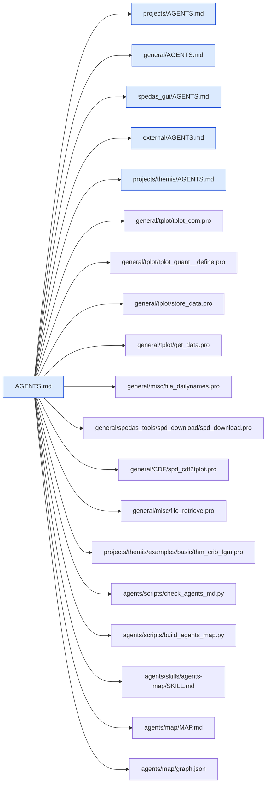

## `external/AGENTS.md`

Parent: `AGENTS.md`. Children: none.

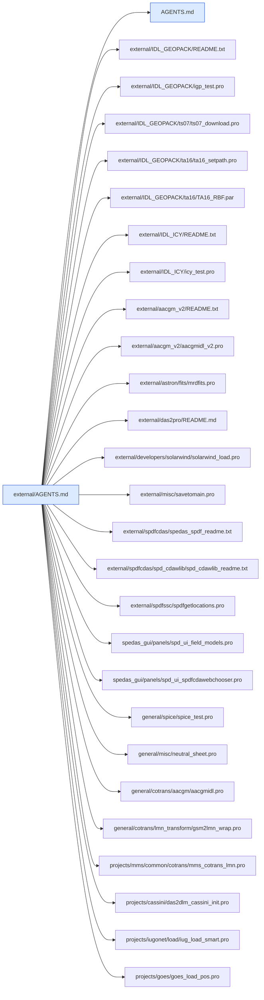

## `general/AGENTS.md`

Parent: `AGENTS.md`. Children: `general/CDF/AGENTS.md`, `general/cotrans/AGENTS.md`, `general/misc/AGENTS.md`, `general/missions/AGENTS.md`, `general/science/AGENTS.md`, `general/spedas_tools/AGENTS.md`, `general/spice/AGENTS.md`, `general/tools/AGENTS.md`, `general/tplot/AGENTS.md`.

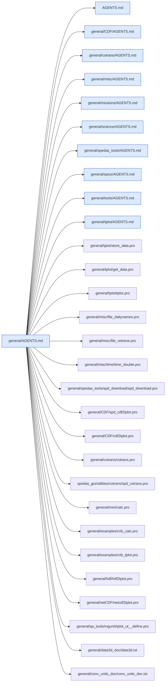

## `general/CDF/AGENTS.md`

Parent: `general/AGENTS.md`. Children: none.

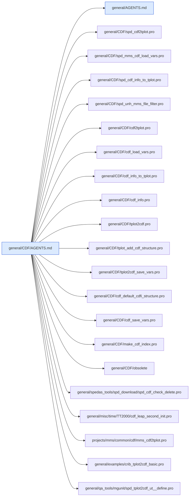

## `general/cotrans/AGENTS.md`

Parent: `general/AGENTS.md`. Children: none.

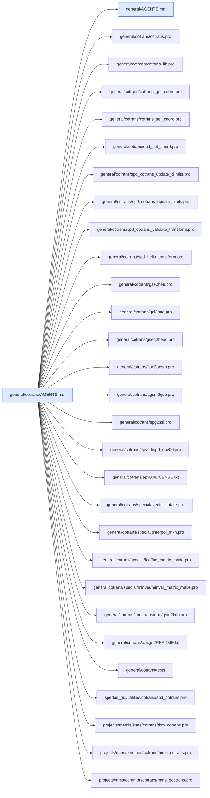

## `general/misc/AGENTS.md`

Parent: `general/AGENTS.md`. Children: none.

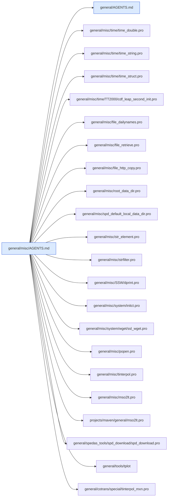

## `general/missions/AGENTS.md`

Parent: `general/AGENTS.md`. Children: `general/missions/fast/AGENTS.md`, `general/missions/rbsp/AGENTS.md`.

```mermaid
graph LR
  classDef agents fill:#dbeafe,stroke:#1d4ed8
  classDef missing fill:#fee2e2,stroke:#b91c1c,stroke-dasharray:4
  self["general/missions/AGENTS.md"]:::agents
  self --> r0["general/AGENTS.md"]:::agents
  self --> r1["general/missions/fast/AGENTS.md"]:::agents
  self --> r2["general/missions/rbsp/AGENTS.md"]:::agents
  self --> r3["projects/AGENTS.md"]:::agents
  self --> r4["projects/wind/AGENTS.md"]:::agents
  self --> r5["projects/goes/AGENTS.md"]:::agents
  self --> r6["projects/dscovr/AGENTS.md"]:::agents
  self --> r7["general/missions/ISTP/omni_hro_load.pro"]
  self --> r8["general/missions/ace/ace_init.pro"]
  self --> r9["general/missions/ace/ace_mfi_load.pro"]
  self --> r10["general/missions/ace/ace_swe_load.pro"]
  self --> r11["general/missions/ace/ace_epm_load.pro"]
  self --> r12["general/missions/ace/ace_mag_swepam_load.pro"]
  self --> r13["general/missions/ace/noaa_ace_nrt_load.pro"]
  self --> r14["general/missions/ace/spdf_file_source.pro"]
  self --> r15["general/missions/goes/goes_mag_load.pro"]
  self --> r16["general/missions/goes/goes_ep_load.pro"]
  self --> r17["general/missions/kyoto/kyoto_load_ae.pro"]
  self --> r18["general/missions/kyoto/kyoto_load_dst.pro"]
  self --> r19["general/missions/kyoto/kyoto_ae_load.pro"]
  self --> r20["general/missions/kyoto/kyoto_dst_load.pro"]
  self --> r21["general/missions/kyoto/kyoto_crib_load_ae.pro"]
  self --> r22["general/missions/lanl/lanl_mpa_load.pro"]
  self --> r23["general/missions/lanl/lanl_spa_load.pro"]
  self --> r24["general/missions/noaa/noaa_load_kp.pro"]
  self --> r25["general/missions/stereo/stereo_init.pro"]
  self --> r26["general/missions/stereo/st_mag_load.pro"]
  self --> r27["general/missions/stereo/st_crib.pro"]
  self --> r28["general/missions/wind/wind_init.pro"]
  self --> r29["general/missions/wind/istp_init.pro"]
  self --> r30["general/missions/wind/wi_mfi_load.pro"]
  self --> r31["general/missions/wind/wi_swe_load.pro"]
  self --> r32["general/missions/wind/wi_3dp_load.pro"]
  self --> r33["general/missions/wind/wi_or_load.pro"]
  self --> r34["general/missions/wind/wi_waves_load.pro"]
  self --> r35["general/missions/wind/wi_crib.pro"]
  self --> r36["general/missions/wind/waves/wi_tds_dustimpact_load.pro"]
  self --> r37["projects/ace/spedas_plugin/ace_ui_import_data.pro"]
  self --> r38["projects/fast/spedas_plugin/fast_ui_import_data.pro"]
  self --> r39["projects/wind/spedas_plugin/wind_ui_import_data.pro"]
  self --> r40["projects/geom_indices/spedas_plugin/idx_ui_import_data.pro"]
  self --> r41["projects/omni/omni_load_data.pro"]
  self --> r42["general/misc/file_retrieve.pro"]
  self --> r43["general/spedas_tools/spd_download/spd_download.pro"]
  self --> r44["general/CDF/cdf2tplot.pro"]
```

## `general/missions/fast/AGENTS.md`

Parent: `general/missions/AGENTS.md`. Children: none.

```mermaid
graph LR
  classDef agents fill:#dbeafe,stroke:#1d4ed8
  classDef missing fill:#fee2e2,stroke:#b91c1c,stroke-dasharray:4
  self["general/missions/fast/AGENTS.md"]:::agents
  self --> r0["general/missions/AGENTS.md"]:::agents
  self --> r1["general/missions/fast/fa_general/fa_init.pro"]
  self --> r2["general/missions/fast/fa_general/fa_pathnames.pro"]
  self --> r3["general/missions/fast/fa_general/fa_config.pro"]
  self --> r4["general/missions/fast/fa_general/fa_orbit_to_time.pro"]
  self --> r5["general/missions/fast/fa_general/fa_time_to_orbit.pro"]
  self --> r6["general/missions/fast/fa_general/fa_orbitrange.pro"]
  self --> r7["general/missions/fast/fa_esa/l2util/fa_esa_load_l2.pro"]
  self --> r8["general/missions/fast/fa_esa/l2util/fa_esa_l2_tplot.pro"]
  self --> r9["general/missions/fast/fa_esa/l2util/fa_esa_l2_pad.pro"]
  self --> r10["general/missions/fast/fa_esa/l2util/fa_esa_l2_edist.pro"]
  self --> r11["general/missions/fast/fa_esa/l2util/fa_esa_l2gen.pro"]
  self --> r12["general/missions/fast/fa_esa/get_l2/get_fa2_ies.pro"]
  self --> r13["general/missions/fast/fa_esa/cdf_load/fa_load_esa_l1.pro"]
  self --> r14["general/missions/fast/fa_esa/fa_esa_init.pro"]
  self --> r15["general/missions/fast/fa_esa/functions/get_2dt.pro"]
  self --> r16["general/missions/fast/fa_fields/fa_despun_e_load.pro"]
  self --> r17["general/missions/fast/fa_fields/fa_dsp_load.pro"]
  self --> r18["general/missions/fast/fa_fields/fa_sfa_load.pro"]
  self --> r19["general/missions/fast/fa_fields/fa_load_mag_hr_dcb.pro"]
  self --> r20["general/missions/fast/fa_fields/fa_fields_crib.pro"]
  self --> r21["general/missions/fast/fa_k0/fa_k0_load.pro"]
  self --> r22["general/missions/fast/fa_k0/istp_fa_k0_load.pro"]
  self --> r23["general/missions/fast/fa_ops/README.pro"]
  self --> r24["general/missions/fast/fa_ops/get_md_from_sdt.pro"]
  self --> r25["general/missions/fast/fa_file_source.pro"]
  self --> r26["general/missions/fast/fa_orbit_time.pro"]
  self --> r27["general/missions/fast/fast_demo_l2.pro"]
  self --> r28["general/missions/fast/fast_demo.crib"]
  self --> r29["general/missions/fast/fast_orbit_times.sav"]
  self --> r30["projects/fast/spedas_plugin/fast_ui_load_data.pro"]
  self --> r31["projects/fast/spedas_plugin/fast_ui_import_data.pro"]
  self --> r32["spedas_gui/plugins/fast_plugin.txt"]
  self --> r33["general/misc/file_retrieve.pro"]
  self --> r34["general/CDF/cdf2tplot.pro"]
```

## `general/missions/rbsp/AGENTS.md`

Parent: `general/missions/AGENTS.md`. Children: none.

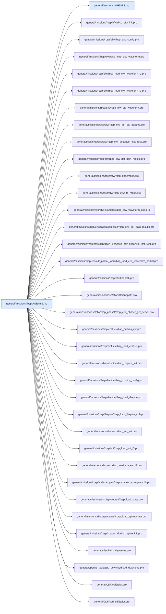

## `general/science/AGENTS.md`

Parent: `general/AGENTS.md`. Children: none.

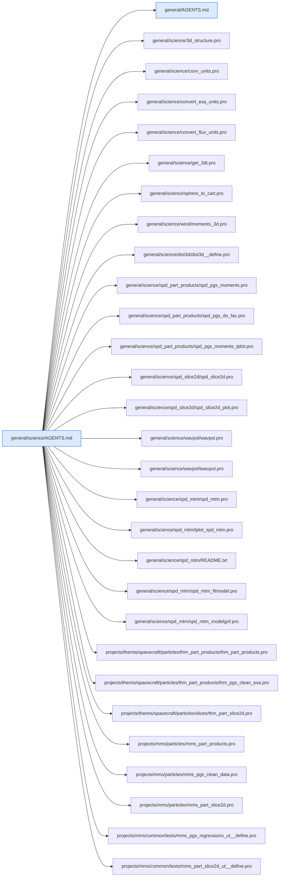

## `general/spedas_tools/AGENTS.md`

Parent: `general/AGENTS.md`. Children: none.

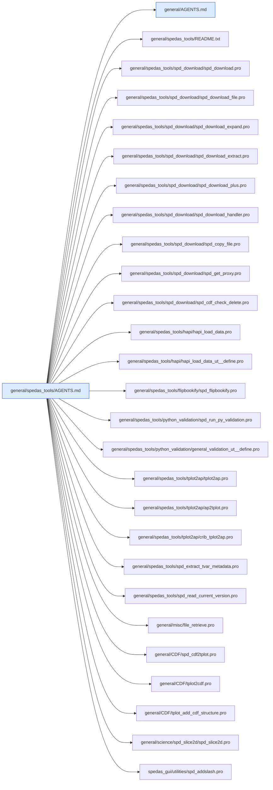

## `general/spice/AGENTS.md`

Parent: `general/AGENTS.md`. Children: none.

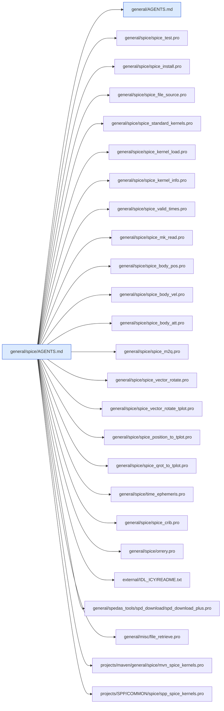

## `general/tools/AGENTS.md`

Parent: `general/AGENTS.md`. Children: none.

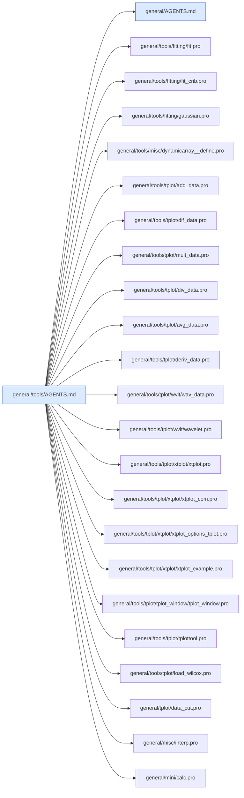

## `general/tplot/AGENTS.md`

Parent: `general/AGENTS.md`. Children: none.

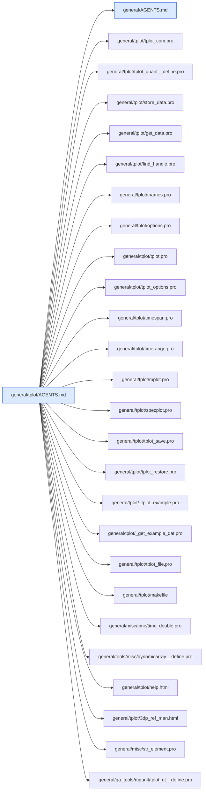

## `projects/AGENTS.md`

Parent: `AGENTS.md`. Children: `projects/SPP/AGENTS.md`, `projects/SWFO/AGENTS.md`, `projects/barrel/AGENTS.md`, `projects/cluster/AGENTS.md`, `projects/dscovr/AGENTS.md`, `projects/elfin/AGENTS.md`, `projects/emm/AGENTS.md`, `projects/erg/AGENTS.md`, `projects/escapade/AGENTS.md`, `projects/goes/AGENTS.md`, `projects/icon/AGENTS.md`, `projects/iugonet/AGENTS.md`, `projects/kaguya/AGENTS.md`, `projects/maven/AGENTS.md`, `projects/mex/AGENTS.md`, `projects/mms/AGENTS.md`, `projects/poes/AGENTS.md`, `projects/secs/AGENTS.md`, `projects/swx/AGENTS.md`, `projects/themis/AGENTS.md`, `projects/vex/AGENTS.md`, `projects/wind/AGENTS.md`.

```mermaid
graph LR
  classDef agents fill:#dbeafe,stroke:#1d4ed8
  classDef missing fill:#fee2e2,stroke:#b91c1c,stroke-dasharray:4
  self["projects/AGENTS.md"]:::agents
  self --> r0["AGENTS.md"]:::agents
  self --> r1["projects/SPP/AGENTS.md"]:::agents
  self --> r2["projects/SWFO/AGENTS.md"]:::agents
  self --> r3["projects/barrel/AGENTS.md"]:::agents
  self --> r4["projects/cluster/AGENTS.md"]:::agents
  self --> r5["projects/dscovr/AGENTS.md"]:::agents
  self --> r6["projects/elfin/AGENTS.md"]:::agents
  self --> r7["projects/emm/AGENTS.md"]:::agents
  self --> r8["projects/erg/AGENTS.md"]:::agents
  self --> r9["projects/escapade/AGENTS.md"]:::agents
  self --> r10["projects/goes/AGENTS.md"]:::agents
  self --> r11["projects/icon/AGENTS.md"]:::agents
  self --> r12["projects/iugonet/AGENTS.md"]:::agents
  self --> r13["projects/kaguya/AGENTS.md"]:::agents
  self --> r14["projects/maven/AGENTS.md"]:::agents
  self --> r15["projects/mex/AGENTS.md"]:::agents
  self --> r16["projects/mms/AGENTS.md"]:::agents
  self --> r17["projects/poes/AGENTS.md"]:::agents
  self --> r18["projects/secs/AGENTS.md"]:::agents
  self --> r19["projects/swx/AGENTS.md"]:::agents
  self --> r20["projects/themis/AGENTS.md"]:::agents
  self --> r21["projects/vex/AGENTS.md"]:::agents
  self --> r22["projects/wind/AGENTS.md"]:::agents
  self --> r23["general/missions/AGENTS.md"]:::agents
  self --> r24["general/CDF/AGENTS.md"]:::agents
  self --> r25["projects/ace/spedas_plugin/ace_ui_import_data.pro"]
  self --> r26["projects/akebono/orb/akb_load_orb.pro"]
  self --> r27["projects/akebono/pws/akb_load_pws.pro"]
  self --> r28["projects/akebono/rdm/akb_load_rdm.pro"]
  self --> r29["projects/bas/bas_load_data.pro"]
  self --> r30["projects/bas/bas_init.pro"]
  self --> r31["projects/cassini/das2dlm_load_cassini_mag_mag.pro"]
  self --> r32["projects/fast/spedas_plugin/fast_ui_import_data.pro"]
  self --> r33["projects/geom_indices/geom_indices_init.pro"]
  self --> r34["projects/geom_indices/spedas_plugin/idx_ui_import_data.pro"]
  self --> r35["projects/geotail/geotail_load_data.pro"]
  self --> r36["projects/goesr/goesr_load_data.pro"]
  self --> r37["projects/goesr/goesr_init.pro"]
  self --> r38["projects/hermes/hermes_init_realtime.pro"]
  self --> r39["projects/juno/juno_load_data.pro"]
  self --> r40["projects/juno/das2tplot.pro"]
  self --> r41["projects/kompsat/kompsat_load_data.pro"]
  self --> r42["projects/kompsat/kompsat_readme.txt"]
  self --> r43["projects/kompsat/check_esa_hapi_connection.pro"]
  self --> r44["projects/ksem/ksem_init.pro"]
  self --> r45["projects/lomonosov/lomo_load_data.pro"]
  self --> r46["projects/lomonosov/lomo_init.pro"]
  self --> r47["projects/lusee/lusee_load.pro"]
  self --> r48["projects/mica/mica_load_induction.pro"]
  self --> r49["projects/omni/omni_load_data.pro"]
  self --> r50["projects/omni/omni_solarwind_load.pro"]
  self --> r51["projects/tracers/load_data/tracers_load_data.pro"]
  self --> r52["projects/tracers/common/tracers_init.pro"]
  self --> r53["projects/goes/goes_init.pro"]
  self --> r54["projects/goes/goes_read_config.pro"]
  self --> r55["projects/goes/goes_config_filedir.pro"]
  self --> r56["projects/goes/goes_load_data.pro"]
  self --> r57["projects/themis/common/thm_load_xxx.pro"]
  self --> r58["projects/maven/general/mvn_file_source.pro"]
  self --> r59["general/misc/file_retrieve.pro"]
  self --> r60["general/misc/file_dailynames.pro"]
  self --> r61["general/spedas_tools/spd_download/spd_download.pro"]
  self --> r62["general/CDF/spd_cdf2tplot.pro"]
  self --> r63["general/CDF/cdf2tplot.pro"]
  self --> r64["general/netCDF/netcdf2tplot.pro"]
  self --> r65["general/hdf/hdf2tplot.pro"]
  self --> r66["spedas_gui/plugins/goes_plugin.txt"]
  self --> r67["spedas_gui/objects/spd_ui_plugin_manager__define.pro"]
```

## `projects/SPP/AGENTS.md`

Parent: `projects/AGENTS.md`. Children: `projects/SPP/COMMON/AGENTS.md`, `projects/SPP/fields/AGENTS.md`, `projects/SPP/sweap/AGENTS.md`.

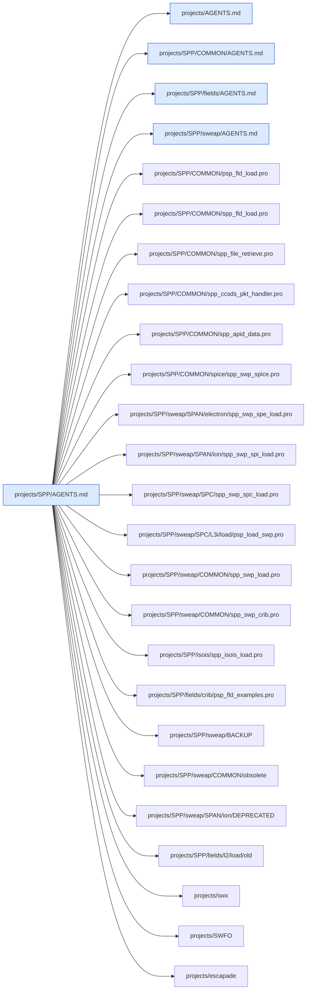

## `projects/SPP/COMMON/AGENTS.md`

Parent: `projects/SPP/AGENTS.md`. Children: none.

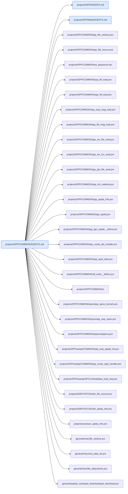

## `projects/SPP/fields/AGENTS.md`

Parent: `projects/SPP/AGENTS.md`. Children: none.

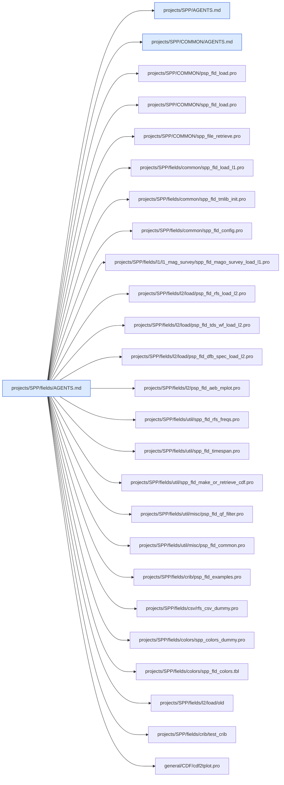

## `projects/SPP/sweap/AGENTS.md`

Parent: `projects/SPP/AGENTS.md`. Children: none.

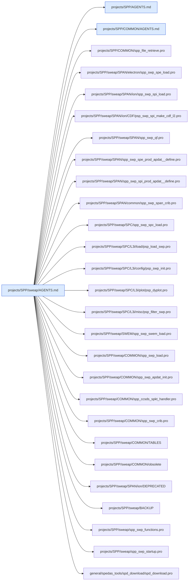

## `projects/SWFO/AGENTS.md`

Parent: `projects/AGENTS.md`. Children: `projects/SWFO/STIS/AGENTS.md`.

```mermaid
graph LR
  classDef agents fill:#dbeafe,stroke:#1d4ed8
  classDef missing fill:#fee2e2,stroke:#b91c1c,stroke-dasharray:4
  self["projects/SWFO/AGENTS.md"]:::agents
  self --> r0["projects/AGENTS.md"]:::agents
  self --> r1["projects/SWFO/STIS/AGENTS.md"]:::agents
  self --> r2["projects/SPP/COMMON/AGENTS.md"]:::agents
  self --> r3["projects/SWFO/swfo_load.pro"]
  self --> r4["projects/SWFO/swfo_noaa_load.pro"]
  self --> r5["projects/SWFO/swfo_ccsds_frame_read.pro"]
  self --> r6["projects/SWFO/swfo_aws_nc2sav_makefile.pro"]
  self --> r7["projects/SWFO/swfo_quicklook.pro"]
  self --> r8["projects/SWFO/swfo_ql_browser.shtml"]
  self --> r9["projects/SWFO/ncdf2struct.pro"]
  self --> r10["projects/SWFO/struct2ncdf.pro"]
  self --> r11["projects/SWFO/swfo_sc_100_apdat__define.pro"]
  self --> r12["projects/SWFO/mag/swfo_mag_sci_apdat__define.pro"]
  self --> r13["projects/SWFO/mag/swfo_mag_decom.pro"]
  self --> r14["projects/SWFO/STIS/swfo_stis_load.pro"]
  self --> r15["projects/SWFO/STIS/swfo_stis_apdat_init.pro"]
  self --> r16["projects/SWFO/STIS/swfo_ncdf_read.pro"]
  self --> r17["projects/SWFO/STIS/swfo_stis_sci_level_2.pro"]
  self --> r18["general/spedas_tools/spd_download/spd_download.pro"]
  self --> r19["general/misc/file_retrieve.pro"]
  self --> r20["general/tools/misc/dynamicarray__define.pro"]
  self --> r21["general/tplot/store_data.pro"]
```

## `projects/SWFO/STIS/AGENTS.md`

Parent: `projects/SWFO/AGENTS.md`. Children: none.

```mermaid
graph LR
  classDef agents fill:#dbeafe,stroke:#1d4ed8
  classDef missing fill:#fee2e2,stroke:#b91c1c,stroke-dasharray:4
  self["projects/SWFO/STIS/AGENTS.md"]:::agents
  self --> r0["projects/SWFO/AGENTS.md"]:::agents
  self --> r1["projects/SPP/COMMON/AGENTS.md"]:::agents
  self --> r2["projects/SWFO/STIS/swfo_stis_load.pro"]
  self --> r3["projects/SWFO/swfo_aws_nc2sav_makefile.pro"]
  self --> r4["projects/SWFO/swfo_ccsds_frame_read.pro"]
  self --> r5["projects/SWFO/STIS/swfo_apdat_info.pro"]
  self --> r6["projects/SWFO/STIS/swfo_apdat.pro"]
  self --> r7["projects/SWFO/STIS/swfo_stis_apdat_init.pro"]
  self --> r8["projects/SWFO/STIS/swfo_gen_apdat__define.pro"]
  self --> r9["projects/SWFO/STIS/ccsds_frame_reader__define.pro"]
  self --> r10["projects/SWFO/STIS/ccsds_reader__define.pro"]
  self --> r11["projects/SWFO/STIS/cmblk_reader__define.pro"]
  self --> r12["projects/SWFO/STIS/gsemsg_reader__define.pro"]
  self --> r13["projects/SWFO/STIS/ptp_reader__define.pro"]
  self --> r14["projects/SWFO/STIS/swfo_stis_sci_apdat__define.pro"]
  self --> r15["projects/SWFO/STIS/swfo_stis_nse_apdat__define.pro"]
  self --> r16["projects/SWFO/STIS/swfo_stis_hkp_apdat__define.pro"]
  self --> r17["projects/SWFO/STIS/swfo_stis_sci_level_0b.pro"]
  self --> r18["projects/SWFO/STIS/swfo_stis_sci_level_1a.pro"]
  self --> r19["projects/SWFO/STIS/swfo_stis_sci_level_1b.pro"]
  self --> r20["projects/SWFO/STIS/swfo_stis_sci_level_2.pro"]
  self --> r21["projects/SWFO/STIS/swfo_stis_sci_level_0b_defunct.pro"]
  self --> r22["projects/SWFO/STIS/swfo_stis_inst_response_calval.pro"]
  self --> r23["projects/SWFO/STIS/swfo_stis_adc_map.pro"]
  self --> r24["projects/SWFO/STIS/swfo_stis_write_ground_lut_from_calval.pro"]
  self --> r25["projects/SWFO/STIS/groundlut_template.sh"]
  self --> r26["projects/SWFO/STIS/templates/sfwo_stis_l0b_MASTER.nc"]
  self --> r27["projects/SWFO/STIS/swfo_ncdf_read.pro"]
  self --> r28["projects/SWFO/STIS/swfo_ncdf_create.pro"]
  self --> r29["projects/SWFO/STIS/swfo_stis_tplot.pro"]
  self --> r30["projects/SWFO/STIS/swfo_stis_plot.pro"]
  self --> r31["projects/SWFO/STIS/swfo_stis_crib.pro"]
  self --> r32["projects/SWFO/STIS/swfo_stis_sci_l1b_crib.pro"]
  self --> r33["projects/SWFO/STIS/swfo_init_realtime.pro"]
  self --> r34["projects/SWFO/STIS/swfo_file_retrieve.pro"]
  self --> r35["projects/SWFO/STIS/swfo_file_source.pro"]
  self --> r36["projects/SWFO/STIS/ace_load.pro"]
  self --> r37["general/misc/file_stuff/socket_reader__define.pro"]
  self --> r38["general/tools/misc/dynamicarray__define.pro"]
```

## `projects/barrel/AGENTS.md`

Parent: `projects/AGENTS.md`. Children: none.

```mermaid
graph LR
  classDef agents fill:#dbeafe,stroke:#1d4ed8
  classDef missing fill:#fee2e2,stroke:#b91c1c,stroke-dasharray:4
  self["projects/barrel/AGENTS.md"]:::agents
  self --> r0["projects/AGENTS.md"]:::agents
  self --> r1["projects/barrel/README.txt"]
  self --> r2["projects/barrel/barrel_load_data.pro"]
  self --> r3["projects/barrel/barrel_preload_actions.pro"]
  self --> r4["projects/barrel/barrel_load_fspc.pro"]
  self --> r5["projects/barrel/barrel_load_mspc.pro"]
  self --> r6["projects/barrel/barrel_load_sspc.pro"]
  self --> r7["projects/barrel/barrel_load_magn.pro"]
  self --> r8["projects/barrel/barrel_load_ephm.pro"]
  self --> r9["projects/barrel/barrel_init.pro"]
  self --> r10["projects/barrel/barrel_read_config.pro"]
  self --> r11["projects/barrel/barrel_write_config.pro"]
  self --> r12["projects/barrel/barrel_config_filedir.pro"]
  self --> r13["projects/barrel/barrel_crib_basic_usage.pro"]
  self --> r14["projects/barrel/brl_makeedges.pro"]
  self --> r15["projects/barrel/brl_makebkgd.pro"]
  self --> r16["projects/barrel/barrel_sp_v3.7/barrel_spectroscopy.pro"]
  self --> r17["projects/barrel/barrel_sp_v3.7/barrel_spectroscopy_crib.pro"]
  self --> r18["projects/barrel/barrel_sp_v3.7/barrel_find_file.pro"]
  self --> r19["projects/barrel/spedas_plugin/barrel_ui_load_data.pro"]
  self --> r20["projects/barrel/spedas_plugin/barrel_ui_import_data.pro"]
  self --> r21["projects/barrel/spedas_plugin/barrel_fileconfig.pro"]
  self --> r22["spedas_gui/plugins/barrel_plugin.txt"]
  self --> r23["general/misc/file_dailynames.pro"]
  self --> r24["general/misc/file_retrieve.pro"]
  self --> r25["general/CDF/cdf2tplot.pro"]
```

## `projects/cluster/AGENTS.md`

Parent: `projects/AGENTS.md`. Children: none.

```mermaid
graph LR
  classDef agents fill:#dbeafe,stroke:#1d4ed8
  classDef missing fill:#fee2e2,stroke:#b91c1c,stroke-dasharray:4
  self["projects/cluster/AGENTS.md"]:::agents
  self --> r0["projects/AGENTS.md"]:::agents
  self --> r1["projects/cluster/common/cl_load_data.pro"]
  self --> r2["projects/cluster/common/cl_init.pro"]
  self --> r3["projects/cluster/common/cl_config.pro"]
  self --> r4["projects/cluster/common/cl_config_filedir.pro"]
  self --> r5["projects/cluster/fgm/cl_load_fgm.pro"]
  self --> r6["projects/cluster/cluster_science_archive/cl_load_csa.pro"]
  self --> r7["projects/cluster/cluster_science_archive/cl_csa_init.pro"]
  self --> r8["projects/cluster/cluster_science_archive/cl_csa_config.pro"]
  self --> r9["projects/cluster/cluster_science_archive/cl_load_csa_crib.pro"]
  self --> r10["projects/cluster/cluster_science_archive/cluster_csa_cdf_check.pro"]
  self --> r11["projects/cluster/examples/cl_load_crib.pro"]
  self --> r12["projects/cluster/spedas_plugin/cl_ui_load_data.pro"]
  self --> r13["projects/cluster/spedas_plugin/cl_ui_load_data_load_pro.pro"]
  self --> r14["projects/cluster/spedas_plugin/cl_csa_ui_load_data.pro"]
  self --> r15["projects/cluster/spedas_plugin/cl_csa_ui_load_data_load_pro.pro"]
  self --> r16["spedas_gui/plugins/cl_plugin.txt"]
  self --> r17["spedas_gui/plugins/cl_csa_plugin.txt"]
  self --> r18["general/misc/file_dailynames.pro"]
  self --> r19["general/spedas_tools/spd_download/spd_download.pro"]
  self --> r20["general/CDF/spd_cdf2tplot.pro"]
```

## `projects/dscovr/AGENTS.md`

Parent: `projects/AGENTS.md`. Children: none.

```mermaid
graph LR
  classDef agents fill:#dbeafe,stroke:#1d4ed8
  classDef missing fill:#fee2e2,stroke:#b91c1c,stroke-dasharray:4
  self["projects/dscovr/AGENTS.md"]:::agents
  self --> r0["projects/AGENTS.md"]:::agents
  self --> r1["projects/dscovr/config/dsc_init.pro"]
  self --> r2["projects/dscovr/config/dsc_read_config.pro"]
  self --> r3["projects/dscovr/config/dsc_write_config.pro"]
  self --> r4["projects/dscovr/config/dsc_config_filedir.pro"]
  self --> r5["projects/dscovr/load/dsc_load_mag.pro"]
  self --> r6["projects/dscovr/load/dsc_load_fc.pro"]
  self --> r7["projects/dscovr/load/dsc_load_or.pro"]
  self --> r8["projects/dscovr/load/dsc_load_att.pro"]
  self --> r9["projects/dscovr/load/dsc_load_all.pro"]
  self --> r10["projects/dscovr/misc/dsc_ezname.pro"]
  self --> r11["projects/dscovr/misc/dsc_getrname.pro"]
  self --> r12["projects/dscovr/misc/dsc_set_ytitle.pro"]
  self --> r13["projects/dscovr/plot/dsc_overview.pro"]
  self --> r14["projects/dscovr/plot/dsc_dyplot.pro"]
  self --> r15["projects/dscovr/mission_compare/dsc_mission_compare__define.pro"]
  self --> r16["projects/dscovr/mission_compare/dsc_mission_compare__plot.pro"]
  self --> r17["projects/dscovr/mission_compare/helpers/ace_ezname.pro"]
  self --> r18["projects/dscovr/mission_compare/helpers/wi_ezname.pro"]
  self --> r19["projects/dscovr/examples/dsc_crib.pro"]
  self --> r20["projects/dscovr/examples/dsc_mission_compare_crib.pro"]
  self --> r21["projects/dscovr/QA/dsc_cltestsuite.pro"]
  self --> r22["projects/dscovr/spedas_plugin/dsc_ui_load_data.pro"]
  self --> r23["projects/dscovr/spedas_plugin/spd_ui_dsc_fileconfig.pro"]
  self --> r24["spedas_gui/plugins/dsc_plugin.txt"]
  self --> r25["spedas_gui/utilities/test_support_routines/spd_init_tests.pro"]
  self --> r26["general/CDF/cdf2tplot.pro"]
  self --> r27["general/misc/file_dailynames.pro"]
  self --> r28["general/spedas_tools/spd_download/spd_download.pro"]
  self --> r29["general/missions/wind/wi_mfi_load.pro"]
  self --> r30["general/missions/ace/ace_mfi_load.pro"]
```

## `projects/elfin/AGENTS.md`

Parent: `projects/AGENTS.md`. Children: none.

```mermaid
graph LR
  classDef agents fill:#dbeafe,stroke:#1d4ed8
  classDef missing fill:#fee2e2,stroke:#b91c1c,stroke-dasharray:4
  self["projects/elfin/AGENTS.md"]:::agents
  self --> r0["projects/AGENTS.md"]:::agents
  self --> r1["projects/elfin/common/elf_init.pro"]
  self --> r2["projects/elfin/common/elf_config.pro"]
  self --> r3["projects/elfin/common/elf_init_public.pro"]
  self --> r4["projects/elfin/load_data/elf_load_data.pro"]
  self --> r5["projects/elfin/load_data/elf_load_fgm.pro"]
  self --> r6["projects/elfin/load_data/elf_load_epd.pro"]
  self --> r7["projects/elfin/load_data/elf_load_state.pro"]
  self --> r8["projects/elfin/load_data/elf_load_options.pro"]
  self --> r9["projects/elfin/load_data/elf_get_local_files.pro"]
  self --> r10["projects/elfin/load_data/elf_epd_l1_postproc.pro"]
  self --> r11["projects/elfin/load_data/elf_cdf2tplot.pro"]
  self --> r12["projects/elfin/load_data/elf_getspec.pro"]
  self --> r13["projects/elfin/load_data/elf_get_phase_delays.pro"]
  self --> r14["projects/elfin/cal_data/elf_cal_epd.pro"]
  self --> r15["projects/elfin/cal_data/elf_cal_fgm.pro"]
  self --> r16["projects/elfin/cal_data/elf_read_epd_cal_data.pro"]
  self --> r17["projects/elfin/elf_load_prm.pro"]
  self --> r18["projects/elfin/examples/elf_load_epd_crib.pro"]
  self --> r19["projects/elfin/examples/elf_getspec_crib.pro"]
  self --> r20["projects/elfin/tests/elf_fgm_load_cltestsuite.pro"]
  self --> r21["spedas_gui/plugins/elfin_plugin.txt"]
  self --> r22["general/misc/file_dailynames.pro"]
  self --> r23["general/spedas_tools/spd_download/spd_download.pro"]
  self --> r24["general/CDF/spd_cdf2tplot.pro"]
  self --> r25["general/misc/spd_default_local_data_dir.pro"]
```

## `projects/emm/AGENTS.md`

Parent: `projects/AGENTS.md`. Children: none.

```mermaid
graph LR
  classDef agents fill:#dbeafe,stroke:#1d4ed8
  classDef missing fill:#fee2e2,stroke:#b91c1c,stroke-dasharray:4
  self["projects/emm/AGENTS.md"]:::agents
  self --> r0["projects/AGENTS.md"]:::agents
  self --> r1["projects/emm/emm_file_retrieve.pro"]
  self --> r2["projects/emm/emm_emus_examine_disk.pro"]
  self --> r3["projects/emm/emm_emus_binning.pro"]
  self --> r4["projects/emm/emm_emus_image_bar.pro"]
  self --> r5["projects/emm/emm_emus_image_lon_bar.pro"]
  self --> r6["projects/emm/emm_emus_maven_ql.pro"]
  self --> r7["projects/emm/emm_emus_map_disk.pro"]
  self --> r8["projects/emm/emm_emu_map_disk.pro"]
  self --> r9["projects/emm/emm_emus_mvn_joint_images.pro"]
  self --> r10["projects/emm/emm_emu_maven_orbit_plot.pro"]
  self --> r11["projects/emm/emm_int_simple.pro"]
  self --> r12["projects/emm/fixed_map_grid.pro"]
  self --> r13["projects/emm/mvn_emm_crib.pro"]
  self --> r14["projects/emm/OrbitGeometryPlotFiles"]
  self --> r15["projects/emm/OrbitGeometryPlotFiles/mvn_orbproj_panel_emus.pro"]
  self --> r16["projects/emm/OrbitGeometryPlotFiles/mvn_orbproj_panel_brain.pro"]
  self --> r17["projects/emm/OrbitGeometryPlotFiles/plot_mpb.pro"]
  self --> r18["projects/emm/OrbitGeometryPlotFiles/plot_shock.pro"]
  self --> r19["projects/emm/OrbitGeometryPlotFiles/script_test_orbit.pro"]
  self --> r20["projects/emm/OrbitGeometryPlotFiles/._ctload.pro"]
  self --> r21["projects/emm/OrbitGeometryPlotFiles/._br_360x180_pc.sav"]
  self --> r22["projects/emm/OrbitGeometryPlotFiles/br_contours_Morschhauser_spc_dlat1.0_delon1.0_400km.sav"]
  self --> r23["projects/maven/maven_orbit_tplot/mvn_sun_bar.pro"]
  self --> r24["projects/maven/mvn_orb_ql/mvn_orbql_cylplot_panel.pro"]
  self --> r25["projects/maven/iuvs/mvn_iuv_file_retrieve.pro"]
  self --> r26["projects/maven/general/roundst.pro"]
  self --> r27["external/astron/fits/mrdfits.pro"]
```

## `projects/erg/AGENTS.md`

Parent: `projects/AGENTS.md`. Children: `projects/erg/ground/AGENTS.md`, `projects/erg/satellite/AGENTS.md`.

```mermaid
graph LR
  classDef agents fill:#dbeafe,stroke:#1d4ed8
  classDef missing fill:#fee2e2,stroke:#b91c1c,stroke-dasharray:4
  self["projects/erg/AGENTS.md"]:::agents
  self --> r0["projects/AGENTS.md"]:::agents
  self --> r1["projects/erg/ground/AGENTS.md"]:::agents
  self --> r2["projects/erg/satellite/AGENTS.md"]:::agents
  self --> r3["projects/iugonet/AGENTS.md"]:::agents
  self --> r4["projects/erg/CHANGES.txt"]
  self --> r5["projects/erg/tools/print_str_maxlet.pro"]
  self --> r6["projects/erg/tools/show_cdf_att.pro"]
  self --> r7["projects/erg/satellite/erg/common/erg_init.pro"]
  self --> r8["projects/erg/satellite/erg/examples"]
  self --> r9["projects/erg/examples/erg_crib_gmag_isee_fluxgate.pro"]
  self --> r10["projects/erg/examples/erg_crib_superdarn.pro"]
  self --> r11["projects/erg/ground/geomag/erg_load_gmag_isee_fluxgate.pro"]
  self --> r12["general/misc/root_data_dir.pro"]
  self --> r13["general/CDF/cdf2tplot.pro"]
```

## `projects/erg/ground/AGENTS.md`

Parent: `projects/erg/AGENTS.md`. Children: none.

```mermaid
graph LR
  classDef agents fill:#dbeafe,stroke:#1d4ed8
  classDef missing fill:#fee2e2,stroke:#b91c1c,stroke-dasharray:4
  self["projects/erg/ground/AGENTS.md"]:::agents
  self --> r0["projects/erg/AGENTS.md"]:::agents
  self --> r1["projects/iugonet/AGENTS.md"]:::agents
  self --> r2["projects/erg/ground/geomag/erg_load_gmag_isee_fluxgate.pro"]
  self --> r3["projects/erg/ground/geomag/erg_load_gmag_nipr.pro"]
  self --> r4["projects/erg/ground/geomag/erg_load_gmag_magdas_1sec.pro"]
  self --> r5["projects/erg/ground/geomag/erg_load_gmag_stel_fluxgate.pro"]
  self --> r6["projects/erg/ground/camera/erg_load_camera_omti_asi.pro"]
  self --> r7["projects/erg/ground/radar/superdarn/erg_load_sdfit.pro"]
  self --> r8["projects/erg/ground/radar/superdarn/sd_init.pro"]
  self --> r9["projects/erg/ground/radar/superdarn/sd_map_set.pro"]
  self --> r10["projects/erg/ground/radar/superdarn/overlay_map_sdfit.pro"]
  self --> r11["projects/erg/ground/radar/superdarn/loadct_sd.pro"]
  self --> r12["projects/erg/ground/radar/superdarn/splitbeam.pro"]
  self --> r13["projects/erg/ground/radar/superdarn/sd_world_data"]
  self --> r14["projects/erg/ground/radar/superdarn/sdaacgmlib/aacgmfindcoeffile.pro"]
  self --> r15["projects/erg/ground/radar/superdarn/sdfovlib/overlay_map_precal_sdfov.pro"]
  self --> r16["projects/erg/examples/erg_crib_superdarn.pro"]
  self --> r17["projects/erg/examples/erg_crib_gmag_isee_fluxgate.pro"]
  self --> r18["projects/iugonet/plot/map2d/map2d_init.pro"]
  self --> r19["projects/iugonet/load/iug_load_gmag_nipr.pro"]
  self --> r20["general/misc/ssl_check_valid_name.pro"]
  self --> r21["general/misc/root_data_dir.pro"]
  self --> r22["general/CDF/cdf2tplot.pro"]
  self --> r23["general/cotrans/aacgm/aacgmidl.pro"]
```

## `projects/erg/satellite/AGENTS.md`

Parent: `projects/erg/AGENTS.md`. Children: none.

```mermaid
graph LR
  classDef agents fill:#dbeafe,stroke:#1d4ed8
  classDef missing fill:#fee2e2,stroke:#b91c1c,stroke-dasharray:4
  self["projects/erg/satellite/AGENTS.md"]:::agents
  self --> r0["projects/erg/AGENTS.md"]:::agents
  self --> r1["projects/erg/satellite/erg/common/erg_init.pro"]
  self --> r2["projects/erg/satellite/erg/common/erg_graphics_config.pro"]
  self --> r3["projects/erg/satellite/erg/common/erg_export_filever.pro"]
  self --> r4["projects/erg/satellite/erg/common/erg_version_table.pro"]
  self --> r5["projects/erg/satellite/erg/common/set_erg_var_label.pro"]
  self --> r6["projects/erg/satellite/erg/common/cotrans/erg_cotrans.pro"]
  self --> r7["projects/erg/satellite/erg/common/cotrans/erg_load_att.pro"]
  self --> r8["projects/erg/satellite/erg/common/cotrans/erg_interpolate_att.pro"]
  self --> r9["projects/erg/satellite/erg/common/cotrans/dsi2j2000.pro"]
  self --> r10["projects/erg/satellite/erg/common/cotrans/tmpl_erg_att_l2.sav"]
  self --> r11["projects/erg/satellite/erg/mgf/erg_load_mgf.pro"]
  self --> r12["projects/erg/satellite/erg/mgf/erg_load_mgf_pre.pro"]
  self --> r13["projects/erg/satellite/erg/lepe/erg_load_lepe.pro"]
  self --> r14["projects/erg/satellite/erg/particle/erg_mep_part_products.pro"]
  self --> r15["projects/erg/satellite/erg/particle/erg_mepe_get_dist.pro"]
  self --> r16["projects/erg/satellite/erg/particle/erg_lep_part_products.pro"]
  self --> r17["projects/erg/satellite/erg/particle/erg_pgs_make_fac.pro"]
  self --> r18["projects/erg/satellite/erg/particle/isee3d"]
  self --> r19["projects/erg/satellite/erg/examples/erg_crib_mgf.pro"]
  self --> r20["projects/erg/satellite/erg/examples/erg_crib_mepe.pro"]
  self --> r21["projects/erg/tools/print_str_maxlet.pro"]
  self --> r22["general/misc/file_dailynames.pro"]
  self --> r23["general/spedas_tools/spd_download/spd_download.pro"]
  self --> r24["general/CDF/cdf2tplot.pro"]
  self --> r25["spedas_gui/isee3d"]
```

## `projects/escapade/AGENTS.md`

Parent: `projects/AGENTS.md`. Children: none.

```mermaid
graph LR
  classDef agents fill:#dbeafe,stroke:#1d4ed8
  classDef missing fill:#fee2e2,stroke:#b91c1c,stroke-dasharray:4
  self["projects/escapade/AGENTS.md"]:::agents
  self --> r0["projects/AGENTS.md"]:::agents
  self --> r1["projects/escapade/general/esc_file_source.pro"]
  self --> r2["projects/escapade/general/esc_file_retrieve.pro"]
  self --> r3["projects/escapade/general/esc_l0_file_retrieve.pro"]
  self --> r4["projects/escapade/general/esc_mission_phase.pro"]
  self --> r5["projects/escapade/general/esc_gen_crib.pro"]
  self --> r6["projects/escapade/emag/esc_emag_load.pro"]
  self --> r7["projects/escapade/emag/esc_emag_angle.pro"]
  self --> r8["projects/escapade/elp/esc_elp_load.pro"]
  self --> r9["projects/escapade/esa/electron/esc_eesa_load.pro"]
  self --> r10["projects/escapade/esa/electron/esc_eesa_tplot.pro"]
  self --> r11["projects/escapade/esa/ion/esc_iesa_load.pro"]
  self --> r12["projects/escapade/esa/ion/esc_iesa_tplot.pro"]
  self --> r13["projects/escapade/esa/ion/esc_iesa_flight_mas.pro"]
  self --> r14["projects/escapade/esa/common/esc_esa_hk_load.pro"]
  self --> r15["projects/escapade/esa/common/esc_apdat_info.pro"]
  self --> r16["projects/escapade/esa/common/esc_raw_file_read.pro"]
  self --> r17["projects/escapade/esa/common/esc_esatm_reader__define.pro"]
  self --> r18["projects/escapade/esa/common/esc_ccsds_decom.pro"]
  self --> r19["projects/escapade/esa/common/esc_ahkp_apdat__define.pro"]
  self --> r20["projects/escapade/spice/esc_spice_kernels.pro"]
  self --> r21["projects/escapade/spice/esc_spice_load.pro"]
  self --> r22["projects/escapade/spice/esc_eph_load.pro"]
  self --> r23["projects/escapade/quicklook/esc_ql_tplot.pro"]
  self --> r24["projects/escapade/misc/esc_tplot.pro"]
  self --> r25["projects/SPP/AGENTS.md"]:::agents
  self --> r26["projects/SWFO/AGENTS.md"]:::agents
  self --> r27["general/misc/file_retrieve.pro"]
  self --> r28["general/CDF/cdf2tplot.pro"]
```

## `projects/goes/AGENTS.md`

Parent: `projects/AGENTS.md`. Children: none.

```mermaid
graph LR
  classDef agents fill:#dbeafe,stroke:#1d4ed8
  classDef missing fill:#fee2e2,stroke:#b91c1c,stroke-dasharray:4
  self["projects/goes/AGENTS.md"]:::agents
  self --> r0["projects/AGENTS.md"]:::agents
  self --> r1["general/missions/AGENTS.md"]:::agents
  self --> r2["projects/goes/goes_load_data.pro"]
  self --> r3["projects/goes/goes_init.pro"]
  self --> r4["projects/goes/goes_read_config.pro"]
  self --> r5["projects/goes/goes_write_config.pro"]
  self --> r6["projects/goes/goes_config_filedir.pro"]
  self --> r7["projects/goes/goes_combine_tdata.pro"]
  self --> r8["projects/goes/goes_lib.pro"]
  self --> r9["projects/goes/goes_load_pos.pro"]
  self --> r10["projects/goes/goesstruct_to_cdfstruct.pro"]
  self --> r11["projects/goes/goes_overview_plot.pro"]
  self --> r12["projects/goes/goes_overview_plot_wrapper.pro"]
  self --> r13["projects/goes/goes_load_crib_sheet.pro"]
  self --> r14["projects/goes/particles/goes_part_products.pro"]
  self --> r15["projects/goes/particles/goes_get_dist.pro"]
  self --> r16["projects/goes/particles/goes_pgs_make_fac.pro"]
  self --> r17["projects/goes/particles/goes_part_products_crib_sheet.pro"]
  self --> r18["projects/goes/spedas_plugin/goes_ui_load_data.pro"]
  self --> r19["projects/goes/spedas_plugin/goes_ui_import_data.pro"]
  self --> r20["projects/goes/spedas_plugin/goes_fileconfig.pro"]
  self --> r21["projects/goes/spedas_plugin/goes_ui_gen_overplot.pro"]
  self --> r22["projects/goes/spedas_plugin/about_goes.txt"]
  self --> r23["spedas_gui/plugins/goes_plugin.txt"]
  self --> r24["projects/goesr/goesr_load_data.pro"]
  self --> r25["general/missions/goes/goes_mag_load.pro"]
  self --> r26["general/missions/goes/goes_ep_load.pro"]
  self --> r27["general/netCDF/netcdf2tplot.pro"]
  self --> r28["general/misc/file_dailynames.pro"]
  self --> r29["general/spedas_tools/spd_download/spd_download.pro"]
  self --> r30["general/misc/spd_default_local_data_dir.pro"]
  self --> r31["general/cotrans/special/enp/enp_matrix_make.pro"]
  self --> r32["external/spdfssc/spdfgetlocations.pro"]
```

## `projects/icon/AGENTS.md`

Parent: `projects/AGENTS.md`. Children: none.

```mermaid
graph LR
  classDef agents fill:#dbeafe,stroke:#1d4ed8
  classDef missing fill:#fee2e2,stroke:#b91c1c,stroke-dasharray:4
  self["projects/icon/AGENTS.md"]:::agents
  self --> r0["projects/AGENTS.md"]:::agents
  self --> r1["projects/icon/about_icon.txt"]
  self --> r2["projects/icon/load/icon_load_data.pro"]
  self --> r3["projects/icon/load/icon_netcdf2tplot.pro"]
  self --> r4["projects/icon/common/icon_netcdf_load_vars.pro"]
  self --> r5["projects/icon/common/icon_struct_to_cdfstruct.pro"]
  self --> r6["projects/icon/common/icon_dimension_fix.pro"]
  self --> r7["projects/icon/common/icon_check_att.pro"]
  self --> r8["projects/icon/common/icon_doy_date.pro"]
  self --> r9["projects/icon/config/icon_init.pro"]
  self --> r10["projects/icon/config/icon_read_config.pro"]
  self --> r11["projects/icon/config/icon_write_config.pro"]
  self --> r12["projects/icon/config/icon_config_filedir.pro"]
  self --> r13["projects/icon/examples/icon_crib.pro"]
  self --> r14["projects/icon/examples/icon_crib_euv.pro"]
  self --> r15["projects/icon/examples/icon_crib_mighti.pro"]
  self --> r16["projects/icon/spedas_plugin/icon_ui_load_data.pro"]
  self --> r17["projects/icon/spedas_plugin/icon_ui_import_data.pro"]
  self --> r18["projects/icon/spedas_plugin/icon_fileconfig.pro"]
  self --> r19["spedas_gui/plugins/icon_plugin.txt"]
  self --> r20["general/misc/file_dailynames.pro"]
  self --> r21["general/spedas_tools/spd_download/spd_download.pro"]
```

## `projects/iugonet/AGENTS.md`

Parent: `projects/AGENTS.md`. Children: none.

```mermaid
graph LR
  classDef agents fill:#dbeafe,stroke:#1d4ed8
  classDef missing fill:#fee2e2,stroke:#b91c1c,stroke-dasharray:4
  self["projects/iugonet/AGENTS.md"]:::agents
  self --> r0["projects/AGENTS.md"]:::agents
  self --> r1["projects/erg/AGENTS.md"]:::agents
  self --> r2["projects/iugonet/ReadMe.txt"]
  self --> r3["projects/iugonet/load/iug_load_ear.pro"]
  self --> r4["projects/iugonet/load/iug_load_ear_trop_nc.pro"]
  self --> r5["projects/iugonet/load/iug_load_mu_trop_nc.pro"]
  self --> r6["projects/iugonet/load/iug_load_gmag_nipr.pro"]
  self --> r7["projects/iugonet/load/iug_load_gmag_mm210.pro"]
  self --> r8["projects/iugonet/load/iug_load_gmag_wdc.pro"]
  self --> r9["projects/iugonet/load/file_dailynames_iug.pro"]
  self --> r10["projects/iugonet/load/ascii2tplot/ascii2tplot.pro"]
  self --> r11["projects/iugonet/load/ascii2tplot/spd_ui_load_spedas_ascii.pro"]
  self --> r12["projects/iugonet/gui/iug_init.pro"]
  self --> r13["projects/iugonet/gui/iug_ui_load_data.pro"]
  self --> r14["projects/iugonet/gui/iug_ui_load_data_load_pro.pro"]
  self --> r15["projects/iugonet/gui/gui_acknowledgement.pro"]
  self --> r16["projects/iugonet/plot/map2d/map2d_init.pro"]
  self --> r17["projects/iugonet/tools/mddb/iug_get_obsinfo.pro"]
  self --> r18["projects/iugonet/examples/iug_crib_ear.pro"]
  self --> r19["projects/iugonet/examples/iug_crib_map2d.pro"]
  self --> r20["projects/erg/tools/print_str_maxlet.pro"]
  self --> r21["projects/erg/ground/geomag/erg_load_gmag_nipr.pro"]
  self --> r22["projects/erg/ground/radar/superdarn/sd_init.pro"]
  self --> r23["general/misc/ssl_check_valid_name.pro"]
  self --> r24["general/misc/root_data_dir.pro"]
  self --> r25["general/cotrans/aacgm/aacgmidl.pro"]
  self --> r26["general/missions/kyoto"]
  self --> r27["spedas_gui/plugins/iugonet_plugin.txt"]
  self --> r28["spedas_gui/spd_gui.pro"]
```

## `projects/kaguya/AGENTS.md`

Parent: `projects/AGENTS.md`. Children: none.

```mermaid
graph LR
  classDef agents fill:#dbeafe,stroke:#1d4ed8
  classDef missing fill:#fee2e2,stroke:#b91c1c,stroke-dasharray:4
  self["projects/kaguya/AGENTS.md"]:::agents
  self --> r0["projects/AGENTS.md"]:::agents
  self --> r1["projects/kaguya/kgy_crib.pro"]
  self --> r2["projects/kaguya/map/kgy_map_load.pro"]
  self --> r3["projects/kaguya/map/kgy_map_make_tplot.pro"]
  self --> r4["projects/kaguya/map/kgy_map_make_pad.pro"]
  self --> r5["projects/kaguya/map/kgy_clear_com.pro"]
  self --> r6["projects/kaguya/map/pace/kgy_pace_com.pro"]
  self --> r7["projects/kaguya/map/pace/kgy_read_pbf.pro"]
  self --> r8["projects/kaguya/map/pace/kgy_read_inf.pro"]
  self --> r9["projects/kaguya/map/pace/kgy_esa1_get3d.pro"]
  self --> r10["projects/kaguya/map/pace/kgy_pace_convert_units.pro"]
  self --> r11["projects/kaguya/map/pace/kgy_n_3d.pro"]
  self --> r12["projects/kaguya/map/lmag/kgy_lmag_com.pro"]
  self --> r13["projects/kaguya/map/lmag/kgy_read_lmag.pro"]
  self --> r14["projects/kaguya/map/lmag/kgy_svm_com.pro"]
  self --> r15["projects/kaguya/map/lmag/kgy_svm_load.pro"]
  self --> r16["projects/kaguya/lrs/kgy_lrs_load.pro"]
  self --> r17["projects/kaguya/general/kgy_file_retrieve.pro"]
  self --> r18["projects/kaguya/general/kgy_file_source.pro"]
  self --> r19["projects/kaguya/general/spice/kgy_spice_kernels.pro"]
  self --> r20["projects/kaguya/general/spice/kgy_ck_gaps.pro"]
  self --> r21["projects/kaguya/general/spice/kgy_spk_gaps.pro"]
  self --> r22["projects/kaguya/general/spice/kernels/fk/SSE_080125.tf"]
  self --> r23["projects/kaguya/general/spice/kernels/fk/GSE_080125.tf"]
  self --> r24["general/spedas_tools/spd_download/spd_download.pro"]
  self --> r25["general/spice/spice_vector_rotate.pro"]
```

## `projects/maven/AGENTS.md`

Parent: `projects/AGENTS.md`. Children: `projects/maven/general/AGENTS.md`, `projects/maven/lpw/AGENTS.md`, `projects/maven/mag/AGENTS.md`, `projects/maven/models/AGENTS.md`, `projects/maven/quicklook/AGENTS.md`, `projects/maven/sep/AGENTS.md`, `projects/maven/sta/AGENTS.md`, `projects/maven/swea/AGENTS.md`, `projects/maven/swia/AGENTS.md`.

```mermaid
graph LR
  classDef agents fill:#dbeafe,stroke:#1d4ed8
  classDef missing fill:#fee2e2,stroke:#b91c1c,stroke-dasharray:4
  self["projects/maven/AGENTS.md"]:::agents
  self --> r0["projects/AGENTS.md"]:::agents
  self --> r1["projects/maven/general/AGENTS.md"]:::agents
  self --> r2["projects/maven/lpw/AGENTS.md"]:::agents
  self --> r3["projects/maven/mag/AGENTS.md"]:::agents
  self --> r4["projects/maven/models/AGENTS.md"]:::agents
  self --> r5["projects/maven/quicklook/AGENTS.md"]:::agents
  self --> r6["projects/maven/sep/AGENTS.md"]:::agents
  self --> r7["projects/maven/sta/AGENTS.md"]:::agents
  self --> r8["projects/maven/swea/AGENTS.md"]:::agents
  self --> r9["projects/maven/swia/AGENTS.md"]:::agents
  self --> r10["projects/maven/general/mvn_pfp_file_retrieve.pro"]
  self --> r11["projects/maven/general/mvn_file_source.pro"]
  self --> r12["projects/maven/general/mvn_set_userpass.pro"]
  self --> r13["projects/maven/general/mvn_orbit_num.pro"]
  self --> r14["projects/maven/general/spice/mvn_spice_load.pro"]
  self --> r15["projects/maven/euv/mvn_euv_load.pro"]
  self --> r16["projects/maven/euv/mvn_euv_l3_load.pro"]
  self --> r17["projects/maven/ngi/mvn_ngi_load.pro"]
  self --> r18["projects/maven/iuvs/mvn_iuv_file_retrieve.pro"]
  self --> r19["projects/maven/acc/mvn_acc_load_l3.pro"]
  self --> r20["projects/maven/kp/mvn_kp_insitu_check_for_new_l2_files.pro"]
  self --> r21["projects/maven/quicklook/mvn_qlook_load_kp.pro"]
  self --> r22["projects/maven/eph/get_mvn_eph.pro"]
  self --> r23["projects/maven/eph/mvn_pfp_cotrans.pro"]
  self --> r24["projects/maven/maven_orbit_tplot/maven_orbit_tplot.pro"]
  self --> r25["projects/maven/maven_orbit_tplot/maven_orbit_snap.pro"]
  self --> r26["projects/maven/mvn_orb_ql/mvn_orb_ql.pro"]
  self --> r27["projects/maven/mvn_orb_ql/mvn_orb_ql_crib.pro"]
  self --> r28["projects/maven/DPU/mvn_pfp_l0_file_read.pro"]
  self --> r29["projects/maven/DPU/mvn_pfdpu_cmnblk_handler.pro"]
  self --> r30["spedas_gui/plugins/maven_pfp_plugin.txt"]
  self --> r31["projects/maven/mav_gse_structure_append.pro"]
  self --> r32["projects/maven/mvn_spc_met_to_unixtime.pro"]
  self --> r33["projects/maven/mvn_spc_apid_file_read.pro"]
  self --> r34["projects/maven/mvn_pf_make_cdf.pro"]
  self --> r35["projects/maven/morbit.pro"]
  self --> r36["projects/maven/swea/mvn_swe_crib.pro"]
  self --> r37["projects/maven/sep/mvn_lpw_handler.pro"]
  self --> r38["projects/maven/swea/mvn_sta_coldion.pro"]
  self --> r39["projects/maven/swea/mvn_mag_tplot.pro"]
```

## `projects/maven/general/AGENTS.md`

Parent: `projects/maven/AGENTS.md`. Children: none.

```mermaid
graph LR
  classDef agents fill:#dbeafe,stroke:#1d4ed8
  classDef missing fill:#fee2e2,stroke:#b91c1c,stroke-dasharray:4
  self["projects/maven/general/AGENTS.md"]:::agents
  self --> r0["projects/maven/AGENTS.md"]:::agents
  self --> r1["projects/maven/general/mvn_pfp_file_retrieve.pro"]
  self --> r2["projects/maven/general/mvn_file_source.pro"]
  self --> r3["projects/maven/general/mvn_pfp_spd_download.pro"]
  self --> r4["projects/maven/general/mvn_set_userpass.pro"]
  self --> r5["projects/maven/general/mvn_file_retrieve.pro"]
  self --> r6["projects/maven/general/spice/mvn_spice_kernels.pro"]
  self --> r7["projects/maven/general/spice/mvn_spice_load.pro"]
  self --> r8["projects/maven/general/spice/mvn_spice_stat.pro"]
  self --> r9["projects/maven/general/spice/mvn_spice_valid_times.pro"]
  self --> r10["projects/maven/general/spice/mvn_spice_crib.pro"]
  self --> r11["projects/maven/general/spice/mvn_spice_kernels_update.pro"]
  self --> r12["projects/maven/general/mvn_orbit_num.pro"]
  self --> r13["projects/maven/general/mvn_getorb.pro"]
  self --> r14["projects/maven/general/mvn_frame_name.pro"]
  self --> r15["projects/maven/general/mvn_altitude.pro"]
  self --> r16["projects/maven/general/mvn_sundir.pro"]
  self --> r17["projects/maven/general/mvn_ramdir.pro"]
  self --> r18["projects/maven/general/mvn_nadir.pro"]
  self --> r19["projects/maven/general/mvn_earthdir.pro"]
  self --> r20["projects/maven/general/mvn_appdir.pro"]
  self --> r21["projects/maven/general/mvn_topography.pro"]
  self --> r22["projects/maven/general/mvn_ls.pro"]
  self --> r23["projects/maven/general/mvn_mars_year.pro"]
  self --> r24["projects/maven/general/mvn_mars_season2utc.pro"]
  self --> r25["projects/maven/general/mvn_scpot.pro"]
  self --> r26["projects/maven/general/mvn_scpot_com.pro"]
  self --> r27["projects/maven/general/mvn_scpot_defaults.pro"]
  self --> r28["projects/maven/general/mvn_scpot_restore.pro"]
  self --> r29["projects/maven/general/mvn_get_scpot.pro"]
  self --> r30["projects/maven/general/mvn_scpot_comp_dailysave.pro"]
  self --> r31["projects/maven/general/mvn_scpot_survey.pro"]
  self --> r32["projects/maven/general/anc/mvn_spc_anc_reactionwheels.pro"]
  self --> r33["projects/maven/general/anc/mvn_spc_fov_blockage.pro"]
  self --> r34["projects/maven/general/mvn_spc_unixtime_to_met.pro"]
  self --> r35["projects/maven/mvn_spc_met_to_unixtime.pro"]
  self --> r36["projects/maven/general/mvn_common_l0_file_transfer.pro"]
  self --> r37["projects/maven/general/mso2lt.pro"]
  self --> r38["general/misc/mso2lt.pro"]
  self --> r39["general/misc/file_retrieve.pro"]
  self --> r40["general/spice/spice_file_source.pro"]
  self --> r41["general/spedas_tools/spd_download/spd_download_plus.pro"]
  self --> r42["projects/maven/swea/mvn_swe_com.pro"]
```

## `projects/maven/lpw/AGENTS.md`

Parent: `projects/maven/AGENTS.md`. Children: none.

```mermaid
graph LR
  classDef agents fill:#dbeafe,stroke:#1d4ed8
  classDef missing fill:#fee2e2,stroke:#b91c1c,stroke-dasharray:4
  self["projects/maven/lpw/AGENTS.md"]:::agents
  self --> r0["projects/maven/AGENTS.md"]:::agents
  self --> r1["projects/maven/lpw/crib_mvn_lpw_example.pro"]
  self --> r2["projects/maven/lpw/mvn_lpw_load_l2.pro"]
  self --> r3["projects/maven/lpw/mvn_lpw_cdf_read.pro"]
  self --> r4["projects/maven/lpw/mvn_lpw_cdf_latest_file.pro"]
  self --> r5["projects/maven/lpw/mvn_lpw_cdf_read_file.pro"]
  self --> r6["projects/maven/lpw/mvn_lpw_cdf_cdf2tplot.pro"]
  self --> r7["projects/maven/lpw/mvn_lpw_cdf_read_extras.pro"]
  self --> r8["projects/maven/lpw/mvn_lpw_load_l0.pro"]
  self --> r9["projects/maven/lpw/mvn_lpw_load.pro"]
  self --> r10["projects/maven/lpw/mvn_lpw_load_file.pro"]
  self --> r11["projects/maven/lpw/mvn_lpw_r_header_l0.pro"]
  self --> r12["projects/maven/lpw/mvn_lpw_pkt_instrument_constants.pro"]
  self --> r13["projects/maven/lpw/mvn_lpw_anc_get_spice_kernels.pro"]
  self --> r14["projects/maven/lpw/mvn_lpw_anc_spacecraft.pro"]
  self --> r15["projects/maven/lpw/mvn_lpw_anc_boom.pro"]
  self --> r16["projects/maven/lpw/mvn_lpw_cal_read_bias.pro"]
  self --> r17["projects/maven/lpw/mvn_lpw_cdf_write.pro"]
  self --> r18["projects/maven/lpw/mvn_lpw_cdf_produce_l2.pro"]
  self --> r19["projects/maven/lpw/mvn_lpw_save_l0.pro"]
  self --> r20["projects/maven/general/mvn_pfp_file_retrieve.pro"]
  self --> r21["projects/maven/sep/mvn_lpw_handler.pro"]
  self --> r22["projects/maven/swea/mvn_lpw_load_dlm.pro"]
  self --> r23["projects/maven/euv/mvn_euv_load.pro"]
```

## `projects/maven/mag/AGENTS.md`

Parent: `projects/maven/AGENTS.md`. Children: none.

```mermaid
graph LR
  classDef agents fill:#dbeafe,stroke:#1d4ed8
  classDef missing fill:#fee2e2,stroke:#b91c1c,stroke-dasharray:4
  self["projects/maven/mag/AGENTS.md"]:::agents
  self --> r0["projects/maven/AGENTS.md"]:::agents
  self --> r1["projects/maven/mag/mvn_mag_load.pro"]
  self --> r2["projects/maven/mag/mvn_mag_sts_read.pro"]
  self --> r3["projects/maven/mag/mvn_mag_l1_sts_read.pro"]
  self --> r4["projects/maven/mag/mvn_mag_sts_to_sav.pro"]
  self --> r5["projects/maven/mag/mvn_mag_gen_l1_sav.pro"]
  self --> r6["projects/maven/mag/mvn_mag_gen_sav.pro"]
  self --> r7["projects/maven/mag/mvn_mag_batch.pro"]
  self --> r8["projects/maven/mag/mvn_mag_load_ql.pro"]
  self --> r9["projects/maven/mag/mvn_mag_handler.pro"]
  self --> r10["projects/maven/mag/mav_apid_mag_handler.pro"]
  self --> r11["projects/maven/mag/mvn_mag_crib.pro"]
  self --> r12["projects/maven/mag/mvn_mag_geom.pro"]
  self --> r13["projects/maven/mag/mvn_mag_trace.pro"]
  self --> r14["projects/maven/mag/mvn_mag_ql.pro"]
  self --> r15["projects/maven/mag/mvn_mag_ql_tsmaker.pro"]
  self --> r16["projects/maven/mag/maven_mag_pkts_read.pro"]
  self --> r17["projects/maven/general/mvn_pfp_file_retrieve.pro"]
  self --> r18["projects/maven/general/mvn_frame_name.pro"]
  self --> r19["projects/maven/sep/mvn_sep_batch.pro"]
  self --> r20["projects/maven/sep/mvn_save_reduce_timeres.pro"]
  self --> r21["projects/maven/DPU/mvn_pfp_l0_file_read.pro"]
  self --> r22["projects/maven/swea/mvn_mag_tplot.pro"]
  self --> r23["projects/maven/swea/mvn_swe_addmag.pro"]
```

## `projects/maven/models/AGENTS.md`

Parent: `projects/maven/AGENTS.md`. Children: none.

```mermaid
graph LR
  classDef agents fill:#dbeafe,stroke:#1d4ed8
  classDef missing fill:#fee2e2,stroke:#b91c1c,stroke-dasharray:4
  self["projects/maven/models/AGENTS.md"]:::agents
  self --> r0["projects/maven/AGENTS.md"]:::agents
  self --> r1["projects/maven/models/mvn_model_bcrust_load.pro"]
  self --> r2["projects/maven/models/mvn_model_bcrust.pro"]
  self --> r3["projects/maven/models/mvn_model_bcrust_restore.pro"]
  self --> r4["projects/maven/models/mvn_model_bcrust_calc.pro"]
  self --> r5["projects/maven/models/mvn_model_bcrust_alt.pro"]
  self --> r6["projects/maven/models/draw_crustal_fields_on_map.pro"]
  self --> r7["projects/maven/models/martiancrustmodels.sav"]
  self --> r8["projects/maven/models/Morschhauser_spc_dlat1.0_delon1.0_400km.sav"]
  self --> r9["projects/maven/models/pui/mvn_pui_crib.pro"]
  self --> r10["projects/maven/models/pui/mvn_pui_model.pro"]
  self --> r11["projects/maven/models/pui/mvn_pui_data_load.pro"]
  self --> r12["projects/maven/models/pui/mvn_pui_commonblock.pro"]
  self --> r13["projects/maven/models/pui/mvn_pui_tplot.pro"]
  self --> r14["projects/maven/models/pui/readme.txt"]
  self --> r15["projects/maven/models/sep_elec/mvn_sep_elec_peri.pro"]
  self --> r16["projects/maven/models/sep_elec/mvn_sep_elec_load_bcrust.pro"]
  self --> r17["projects/maven/quicklook/mvn_ql_pfp_tplot.pro"]
  self --> r18["projects/maven/swea/mvn_swe_com.pro"]
  self --> r19["projects/maven/sep/mvn_sep_handler_commonblock.pro"]
```

## `projects/maven/quicklook/AGENTS.md`

Parent: `projects/maven/AGENTS.md`. Children: none.

```mermaid
graph LR
  classDef agents fill:#dbeafe,stroke:#1d4ed8
  classDef missing fill:#fee2e2,stroke:#b91c1c,stroke-dasharray:4
  self["projects/maven/quicklook/AGENTS.md"]:::agents
  self --> r0["projects/maven/AGENTS.md"]:::agents
  self --> r1["projects/maven/quicklook/mvn_ql_pfp_tplot.pro"]
  self --> r2["projects/maven/quicklook/mvn_ql_pfp_tplot2.pro"]
  self --> r3["projects/maven/quicklook/mvn_ql_pfp_tplot_save.pro"]
  self --> r4["projects/maven/quicklook/mvn_ql_pfp_tplot_restore.pro"]
  self --> r5["projects/maven/quicklook/mvn_attitude_bar.pro"]
  self --> r6["projects/maven/quicklook/mvn_qlook_burst_bar.pro"]
  self --> r7["projects/maven/quicklook/mvn_spaceweather.pro"]
  self --> r8["projects/maven/quicklook/mvn_qlook_load_kp.pro"]
  self --> r9["projects/maven/quicklook/mvn_qlook_kp_read.pro"]
  self --> r10["projects/maven/quicklook/mvn_over_shell.pro"]
  self --> r11["projects/maven/quicklook/mvn_load_all_qlook.pro"]
  self --> r12["projects/maven/quicklook/mvn_l0_db2file.pro"]
  self --> r13["projects/maven/quicklook/mvn_gen_overplot.pro"]
  self --> r14["projects/maven/quicklook/mvn_qlook_init.pro"]
  self --> r15["projects/maven/quicklook/mvn_call_pfpl2plot.pro"]
  self --> r16["projects/maven/quicklook/mvn_pfpl2_overplot.pro"]
  self --> r17["projects/maven/quicklook/mvn_gen_multipngplot.pro"]
  self --> r18["projects/maven/quicklook/mvn_ngi_read_csv.pro"]
  self --> r19["projects/maven/quicklook/browser/maven_ql_browser.shtml"]
  self --> r20["projects/maven/spedas_plugin/mvn_kp_ui_import_data.pro"]
  self --> r21["projects/maven/models/mvn_model_bcrust_load.pro"]
```

## `projects/maven/sep/AGENTS.md`

Parent: `projects/maven/AGENTS.md`. Children: none.

```mermaid
graph LR
  classDef agents fill:#dbeafe,stroke:#1d4ed8
  classDef missing fill:#fee2e2,stroke:#b91c1c,stroke-dasharray:4
  self["projects/maven/sep/AGENTS.md"]:::agents
  self --> r0["projects/maven/AGENTS.md"]:::agents
  self --> r1["projects/maven/sep/mvn_sep_load.pro"]
  self --> r2["projects/maven/sep/mvn_sep_var_restore.pro"]
  self --> r3["projects/maven/sep/purgatory/mvn_sep_cal_to_tplot.pro"]
  self --> r4["projects/maven/sep/mvn_sep_get_cal_units.pro"]
  self --> r5["projects/maven/sep/mvn_sep_handler.pro"]
  self --> r6["projects/maven/sep/mvn_sep_handler_commonblock.pro"]
  self --> r7["projects/maven/sep/mvn_pfdpu_handler_commonblock.pro"]
  self --> r8["projects/maven/sep/mvn_lpw_handler.pro"]
  self --> r9["projects/maven/sep/mvn_sep_anc_load.pro"]
  self --> r10["projects/maven/sep/ancillary/mvn_sep_get_anc_data.pro"]
  self --> r11["projects/maven/sep/mvn_sep_pad_load_tplot.pro"]
  self --> r12["projects/maven/sep/mvn_sep_pad.pro"]
  self --> r13["projects/maven/sep/mvn_sep_tplot.pro"]
  self --> r14["projects/maven/sep/mvn_sep_crib.pro"]
  self --> r15["projects/maven/sep/mvn_sep_batch.pro"]
  self --> r16["projects/maven/sep/mvn_save_reduce_timeres.pro"]
  self --> r17["projects/maven/sep/mvn_sep_save_reduce_timeres.pro"]
  self --> r18["projects/maven/sep/cdf/mvn_sep_makefile.pro"]
  self --> r19["projects/maven/sep/mvn_sep_make_kp.pro"]
  self --> r20["projects/maven/sep/fov/mvn_sep_fov.pro"]
  self --> r21["projects/maven/sep/mvn_sep_inst_response.pro"]
  self --> r22["projects/maven/DPU/mvn_pfp_l0_file_read.pro"]
  self --> r23["projects/maven/mag/mvn_mag_sts_to_sav.pro"]
  self --> r24["projects/maven/euv/mvn_euv_l0_load.pro"]
```

## `projects/maven/sta/AGENTS.md`

Parent: `projects/maven/AGENTS.md`. Children: none.

```mermaid
graph LR
  classDef agents fill:#dbeafe,stroke:#1d4ed8
  classDef missing fill:#fee2e2,stroke:#b91c1c,stroke-dasharray:4
  self["projects/maven/sta/AGENTS.md"]:::agents
  self --> r0["projects/maven/AGENTS.md"]:::agents
  self --> r1["projects/maven/sta/mvn_sta_l2_load.pro"]
  self --> r2["projects/maven/sta/mvn_sta_l2_tplot.pro"]
  self --> r3["projects/maven/sta/mvn_sta_l2_crib.pro"]
  self --> r4["projects/maven/sta/mvn_sta_l3_load.pro"]
  self --> r5["projects/maven/sta/mvn_sta_l3_load_dlm.pro"]
  self --> r6["projects/maven/sta/mvn_sta_l0_load.pro"]
  self --> r7["projects/maven/sta/mvn_sta_l0_crib.pro"]
  self --> r8["projects/maven/sta/mvn_sta_handler.pro"]
  self --> r9["projects/maven/sta/mvn_sta_prod_cal.pro"]
  self --> r10["projects/maven/sta/mvn_sta_stat.pro"]
  self --> r11["projects/maven/sta/mvn_sta_current_sw_version.pro"]
  self --> r12["projects/maven/sta/mvn_sta_functions/mvn_sta_get.pro"]
  self --> r13["projects/maven/sta/mvn_sta_functions/mvn_sta_get_c6.pro"]
  self --> r14["projects/maven/sta/mvn_sta_functions/mvn_sta_convert_units.pro"]
  self --> r15["projects/maven/sta/l2util/mvn_sta_cmn_l2read.pro"]
  self --> r16["projects/maven/sta/l2util/mvn_sta_l2gen.pro"]
  self --> r17["projects/maven/sta/l2analysis/flow_vectors/mvn_sta_flow.pro"]
  self --> r18["projects/maven/sta/L3_DO_NOT_USE/nbc_4d.pro"]
  self --> r19["projects/maven/sta/STATIC readme.doc"]
  self --> r20["projects/maven/general/mvn_pfp_spd_download.pro"]
  self --> r21["projects/maven/DPU/mvn_pfp_l0_file_read.pro"]
  self --> r22["projects/maven/swea/mvn_sta_coldion.pro"]
```

## `projects/maven/swea/AGENTS.md`

Parent: `projects/maven/AGENTS.md`. Children: none.

```mermaid
graph LR
  classDef agents fill:#dbeafe,stroke:#1d4ed8
  classDef missing fill:#fee2e2,stroke:#b91c1c,stroke-dasharray:4
  self["projects/maven/swea/AGENTS.md"]:::agents
  self --> r0["projects/maven/AGENTS.md"]:::agents
  self --> r1["projects/maven/swea/mvn_swe_crib.pro"]
  self --> r2["projects/maven/swea/mvn_swe_load_l2.pro"]
  self --> r3["projects/maven/swea/mvn_swe_load_l0.pro"]
  self --> r4["projects/maven/swea/mvn_swe_read_l0.pro"]
  self --> r5["projects/maven/swea/mvn_swe_readcdf_3d.pro"]
  self --> r6["projects/maven/swea/mvn_swe_com.pro"]
  self --> r7["projects/maven/swea/mvn_swe_init.pro"]
  self --> r8["projects/maven/swea/mvn_swe_config.pro"]
  self --> r9["projects/maven/swea/mvn_swe_calib.pro"]
  self --> r10["projects/maven/swea/mvn_swe_struct.pro"]
  self --> r11["projects/maven/swea/mvn_swe_spice_init.pro"]
  self --> r12["projects/maven/swea/mvn_swe_get3d.pro"]
  self --> r13["projects/maven/swea/mvn_swe_getpad.pro"]
  self --> r14["projects/maven/swea/mvn_swe_getspec.pro"]
  self --> r15["projects/maven/swea/mvn_swe_convert_units.pro"]
  self --> r16["projects/maven/swea/mvn_swe_sumplot.pro"]
  self --> r17["projects/maven/swea/mvn_swe_sciplot.pro"]
  self --> r18["projects/maven/swea/mvn_swe_addmag.pro"]
  self --> r19["projects/maven/swea/mvn_swe_n1d.pro"]
  self --> r20["projects/maven/swea/mvn_swe_pad_resample.pro"]
  self --> r21["projects/maven/swea/mvn_swe_pad_restore.pro"]
  self --> r22["projects/maven/swea/mvn_swe_sc_pot.pro"]
  self --> r23["projects/maven/swea/mvn_swe_sc_negpot.pro"]
  self --> r24["projects/maven/swea/mvn_swe_edit_quality.pro"]
  self --> r25["projects/maven/swea/swe_engy_snap.pro"]
  self --> r26["projects/maven/swea/swe_pad_snap.pro"]
  self --> r27["projects/maven/swea/swe_3d_snap.pro"]
  self --> r28["projects/maven/swea/mvn_swe_makecdf_3d.pro"]
  self --> r29["projects/maven/swea/crib_l0_to_l2.txt"]
  self --> r30["projects/maven/swea/Test/mvn_swe_load_l2a.pro"]
  self --> r31["projects/maven/swea/mvn_sta_coldion.pro"]
  self --> r32["projects/maven/swea/mvn_lpw_load_dlm.pro"]
  self --> r33["projects/maven/swea/mvn_mag_tplot.pro"]
  self --> r34["projects/maven/general/mvn_scpot.pro"]
  self --> r35["projects/maven/general/mvn_pfp_file_retrieve.pro"]
  self --> r36["projects/maven/l2gen/mvn_swe_l2gen.pro"]
```

## `projects/maven/swia/AGENTS.md`

Parent: `projects/maven/AGENTS.md`. Children: none.

```mermaid
graph LR
  classDef agents fill:#dbeafe,stroke:#1d4ed8
  classDef missing fill:#fee2e2,stroke:#b91c1c,stroke-dasharray:4
  self["projects/maven/swia/AGENTS.md"]:::agents
  self --> r0["projects/maven/AGENTS.md"]:::agents
  self --> r1["projects/maven/swia/mvn_swia_crib.pro"]
  self --> r2["projects/maven/swia/mvn_swia_load_l2_data.pro"]
  self --> r3["projects/maven/swia/mvn_swia_load_l0_data.pro"]
  self --> r4["projects/maven/swia/mvn_swia_make_info_str.pro"]
  self --> r5["projects/maven/swia/mvn_swia_get_3dc.pro"]
  self --> r6["projects/maven/swia/mvn_swia_get_3df.pro"]
  self --> r7["projects/maven/swia/mvn_swia_get_3ds.pro"]
  self --> r8["projects/maven/swia/mvn_swia_convert_units.pro"]
  self --> r9["projects/maven/swia/mvn_swia_common_units.pro"]
  self --> r10["projects/maven/swia/mvn_swia_part_moments.pro"]
  self --> r11["projects/maven/swia/mvn_swia_protonalphamoms.pro"]
  self --> r12["projects/maven/swia/mvn_swia_add_magf.pro"]
  self --> r13["projects/maven/swia/mvn_swia_inst2mso.pro"]
  self --> r14["projects/maven/swia/mvn_swia_regid.pro"]
  self --> r15["projects/maven/swia/mvn_swia_upstream_ave.pro"]
  self --> r16["projects/maven/swia/mvn_swia_3d_snap.pro"]
  self --> r17["projects/maven/swia/mvn_swia_slice2d_snap.pro"]
  self --> r18["projects/maven/swia/mvn_swia_make_l2_data.pro"]
  self --> r19["projects/maven/swia/mvn_swia_plot_packets.pro"]
  self --> r20["projects/maven/general/mvn_pfp_file_retrieve.pro"]
```

## `projects/mex/AGENTS.md`

Parent: `projects/AGENTS.md`. Children: none.

```mermaid
graph LR
  classDef agents fill:#dbeafe,stroke:#1d4ed8
  classDef missing fill:#fee2e2,stroke:#b91c1c,stroke-dasharray:4
  self["projects/mex/AGENTS.md"]:::agents
  self --> r0["projects/AGENTS.md"]:::agents
  self --> r1["projects/vex/AGENTS.md"]:::agents
  self --> r2["projects/mex/aspera/mex_asp_els_load.pro"]
  self --> r3["projects/mex/aspera/mex_asp_ima_load.pro"]
  self --> r4["projects/mex/aspera/mex_asp_swm_load.pro"]
  self --> r5["projects/mex/aspera/mex_asp_els_get.pro"]
  self --> r6["projects/mex/aspera/mex_asp_ima_get.pro"]
  self --> r7["projects/mex/aspera/mex_asp_els_convert_units.pro"]
  self --> r8["projects/mex/aspera/mex_asp_ima_bkg.pro"]
  self --> r9["projects/mex/marsis/mex_marsis_load.pro"]
  self --> r10["projects/mex/marsis/mex_marsis_com.pro"]
  self --> r11["projects/mex/marsis/mex_marsis_snap.pro"]
  self --> r12["projects/mex/marsis/mex_marsis_tplot.pro"]
  self --> r13["projects/mex/spice/mex_spice_kernels.pro"]
  self --> r14["projects/mex/spice/mex_spice_load.pro"]
  self --> r15["projects/mex/spice/mex_orbit_num.pro"]
  self --> r16["general/spedas_tools/spd_download/spd_download.pro"]
  self --> r17["general/misc/file_retrieve.pro"]
  self --> r18["general/spice/spice_file_source.pro"]
```

## `projects/mms/AGENTS.md`

Parent: `projects/AGENTS.md`. Children: `projects/mms/common/AGENTS.md`, `projects/mms/particles/AGENTS.md`, `projects/mms/sitl/AGENTS.md`.

```mermaid
graph LR
  classDef agents fill:#dbeafe,stroke:#1d4ed8
  classDef missing fill:#fee2e2,stroke:#b91c1c,stroke-dasharray:4
  self["projects/mms/AGENTS.md"]:::agents
  self --> r0["projects/AGENTS.md"]:::agents
  self --> r1["projects/mms/common/AGENTS.md"]:::agents
  self --> r2["projects/mms/particles/AGENTS.md"]:::agents
  self --> r3["projects/mms/sitl/AGENTS.md"]:::agents
  self --> r4["projects/mms/about_mms.txt"]
  self --> r5["projects/mms/fgm/mms_load_fgm.pro"]
  self --> r6["projects/mms/fgm/mms_split_fgm_data.pro"]
  self --> r7["projects/mms/fpi/mms_load_fpi.pro"]
  self --> r8["projects/mms/fpi/mms_get_fpi_dist.pro"]
  self --> r9["projects/mms/hpca/mms_load_hpca.pro"]
  self --> r10["projects/mms/mec/mms_load_mec.pro"]
  self --> r11["projects/mms/mec_ascii/mms_load_state.pro"]
  self --> r12["projects/mms/aspoc/mms_load_aspoc.pro"]
  self --> r13["projects/mms/dsp/mms_load_dsp.pro"]
  self --> r14["projects/mms/edi/mms_load_edi.pro"]
  self --> r15["projects/mms/edp/mms_load_edp.pro"]
  self --> r16["projects/mms/eis/mms_load_eis.pro"]
  self --> r17["projects/mms/feeps/mms_load_feeps.pro"]
  self --> r18["projects/mms/fsm/mms_load_fsm.pro"]
  self --> r19["projects/mms/scm/mms_load_scm.pro"]
  self --> r20["projects/mms/sdc/get_mms_sdc_connection.pro"]
  self --> r21["projects/mms/sdc/get_mms_science_file.pro"]
  self --> r22["projects/mms/common/load_data/mms_load_data.pro"]
  self --> r23["projects/mms/common/load_data/mms_login_lasp.pro"]
  self --> r24["projects/mms/common/load_data/mms_load_data_spdf.pro"]
  self --> r25["projects/mms/common/load_data/mms_load_options.pro"]
  self --> r26["projects/mms/common/mms_init.pro"]
  self --> r27["projects/mms/common/mms_config.pro"]
  self --> r28["projects/mms/common/tests/mms_run_all_tests.pro"]
  self --> r29["projects/mms/common/tests/mms_python_validation_ut__define.pro"]
  self --> r30["projects/mms/examples/basic/readme.txt"]
  self --> r31["projects/mms/examples/basic/mms_load_fgm_crib.pro"]
  self --> r32["projects/mms/examples/basic/mms_load_fpi_crib.pro"]
  self --> r33["general/CDF/spd_cdf2tplot.pro"]
  self --> r34["spedas_gui/plugins/mms_plugin.txt"]
```

## `projects/mms/common/AGENTS.md`

Parent: `projects/mms/AGENTS.md`. Children: none.

```mermaid
graph LR
  classDef agents fill:#dbeafe,stroke:#1d4ed8
  classDef missing fill:#fee2e2,stroke:#b91c1c,stroke-dasharray:4
  self["projects/mms/common/AGENTS.md"]:::agents
  self --> r0["projects/mms/AGENTS.md"]:::agents
  self --> r1["projects/mms/common/mms_init.pro"]
  self --> r2["projects/mms/common/mms_config.pro"]
  self --> r3["projects/mms/common/mms_config_filedir.pro"]
  self --> r4["projects/mms/common/mms_config_read.pro"]
  self --> r5["projects/mms/common/mms_proxy.pro"]
  self --> r6["projects/mms/common/load_data/mms_load_data.pro"]
  self --> r7["projects/mms/common/load_data/mms_login_lasp.pro"]
  self --> r8["projects/mms/common/load_data/mms_load_options.pro"]
  self --> r9["projects/mms/common/load_data/mms_load_data_spdf.pro"]
  self --> r10["projects/mms/common/load_data/mms_get_local_files.pro"]
  self --> r11["projects/mms/common/load_data/mms_files_in_interval.pro"]
  self --> r12["projects/mms/common/load_data/mms_check_file_exists.pro"]
  self --> r13["projects/mms/common/load_data/mms_parse_json.pro"]
  self --> r14["projects/mms/common/mms_data_fetch/mms_get_science_file_info.pro"]
  self --> r15["projects/mms/common/mms_data_fetch/mms_data_fetch.pro"]
  self --> r16["projects/mms/common/mms_data_fetch/mms_check_local_cache.pro"]
  self --> r17["projects/mms/common/cdf/mms_cdf2tplot.pro"]
  self --> r18["projects/mms/common/cdf/unh_mms_file_filter.pro"]
  self --> r19["projects/mms/common/cotrans/mms_cotrans.pro"]
  self --> r20["projects/mms/common/cotrans/mms_qcotrans.pro"]
  self --> r21["projects/mms/common/cotrans/mms_cotrans_lmn.pro"]
  self --> r22["projects/mms/common/cotrans/dmpa2gse.pro"]
  self --> r23["projects/mms/common/cotrans/dmpa2dsl.pro"]
  self --> r24["projects/mms/common/curlometer/mms_curl.pro"]
  self --> r25["projects/mms/common/curlometer/mms_lingradest.pro"]
  self --> r26["projects/mms/common/data_status_bar/mms_load_brst_segments.pro"]
  self --> r27["projects/mms/common/data_status_bar/spd_mms_load_bss.pro"]
  self --> r28["projects/mms/common/events/mms_event_search.pro"]
  self --> r29["projects/mms/common/util/mms_jdote.pro"]
  self --> r30["projects/mms/common/util/flatten_spectra.pro"]
  self --> r31["projects/mms/common/tests/mms_run_all_tests.pro"]
  self --> r32["projects/mms/common/tests/mms_python_validation_ut__define.pro"]
  self --> r33["projects/mms/sdc/get_mms_sdc_connection.pro"]
  self --> r34["projects/mms/sdc/get_mms_sitl_connection.pro"]
  self --> r35["projects/mms/sdc/get_mms_file_info.pro"]
  self --> r36["projects/mms/sdc/get_mms_science_file.pro"]
  self --> r37["projects/mms/sdc/mms_sitl_logout.pro"]
  self --> r38["projects/mms/sitl/bss/core/mms_bss_load.pro"]
  self --> r39["projects/mms/mec_ascii/mms_load_state.pro"]
  self --> r40["projects/mms/mec/mms_load_mec.pro"]
  self --> r41["projects/themis/state/thm_interpolate_state.pro"]
  self --> r42["general/CDF/spd_cdf2tplot.pro"]
  self --> r43["general/misc/file_retrieve.pro"]
  self --> r44["spedas_gui/utilities/spd_ui_login_widget.pro"]
  self --> r45["spedas_gui/plugins/mms_plugin.txt"]
  self --> r46["projects/mms/examples/basic/mms_config_crib.pro"]
  self --> r47["projects/mms/examples/basic/mms_cotrans_crib.pro"]
  self --> r48["projects/mms/examples/basic/mms_qcotrans_crib.pro"]
  self --> r49["projects/mms/examples/basic/mms_curlometer_crib.pro"]
```

## `projects/mms/particles/AGENTS.md`

Parent: `projects/mms/AGENTS.md`. Children: none.

```mermaid
graph LR
  classDef agents fill:#dbeafe,stroke:#1d4ed8
  classDef missing fill:#fee2e2,stroke:#b91c1c,stroke-dasharray:4
  self["projects/mms/particles/AGENTS.md"]:::agents
  self --> r0["projects/mms/AGENTS.md"]:::agents
  self --> r1["projects/mms/particles/mms_part_products.pro"]
  self --> r2["projects/mms/particles/mms_part_getspec.pro"]
  self --> r3["projects/mms/particles/mms_part_getpad.pro"]
  self --> r4["projects/mms/particles/mms_part_slice2d.pro"]
  self --> r5["projects/mms/particles/mms_part_isee3d.pro"]
  self --> r6["projects/mms/particles/mms_get_dist.pro"]
  self --> r7["projects/mms/particles/mms_convert_flux_units.pro"]
  self --> r8["projects/mms/particles/mms_part_conv_units.pro"]
  self --> r9["projects/mms/particles/mms_part_des_photoelectrons.pro"]
  self --> r10["projects/mms/particles/mms_pgs_clean_data.pro"]
  self --> r11["projects/mms/particles/mms_pgs_clean_support.pro"]
  self --> r12["projects/mms/particles/mms_pgs_make_fac.pro"]
  self --> r13["projects/mms/particles/mms_pgs_split_hpca.pro"]
  self --> r14["projects/mms/particles/mms_slice1d_plot_fpi.pro"]
  self --> r15["projects/mms/particles/moka"]
  self --> r16["projects/mms/particles/moka/moka_mms_part_products.pro"]
  self --> r17["projects/mms/particles/moka/moka_mms_pad_fpi.pro"]
  self --> r18["projects/mms/particles/deprecated"]
  self --> r19["projects/mms/fpi/mms_get_fpi_dist.pro"]
  self --> r20["projects/mms/fpi/mms_fpi_remove_sw.pro"]
  self --> r21["projects/mms/hpca/mms_get_hpca_dist.pro"]
  self --> r22["projects/mms/common/load_data/mms_load_data.pro"]
  self --> r23["projects/mms/common/cdf/mms_cdf2tplot.pro"]
  self --> r24["general/science/spd_part_products"]
  self --> r25["general/science/spd_slice2d/spd_slice2d.pro"]
  self --> r26["spedas_gui/isee3d/isee_3d.pro"]
  self --> r27["projects/mms/common/tests/mms_part_products_ut__define.pro"]
  self --> r28["projects/mms/common/tests/mms_part_getspec_ut__define.pro"]
  self --> r29["projects/mms/common/tests/mms_part_slice2d_ut__define.pro"]
  self --> r30["projects/mms/common/tests/mms_pgs_validation_ut__define.pro"]
  self --> r31["projects/mms/examples/advanced/mms_part_getspec_crib.pro"]
  self --> r32["projects/mms/examples/advanced/mms_part_getspec_adv_crib.pro"]
  self --> r33["projects/mms/examples/advanced/mms_slice2d_fpi_crib.pro"]
  self --> r34["projects/mms/examples/advanced/mms_slice2d_hpca_crib.pro"]
  self --> r35["projects/mms/examples/advanced/mms_isee_3d_crib.pro"]
```

## `projects/mms/sitl/AGENTS.md`

Parent: `projects/mms/AGENTS.md`. Children: none.

```mermaid
graph LR
  classDef agents fill:#dbeafe,stroke:#1d4ed8
  classDef missing fill:#fee2e2,stroke:#b91c1c,stroke-dasharray:4
  self["projects/mms/sitl/AGENTS.md"]:::agents
  self --> r0["projects/mms/AGENTS.md"]:::agents
  self --> r1["projects/mms/sitl/eva/eva.pro"]
  self --> r2["projects/mms/sitl/eva/parameterSets"]
  self --> r3["projects/mms/sitl/eva/source/cw_data/eva_data.pro"]
  self --> r4["projects/mms/sitl/eva/source/cw_data/eva_data_load_mms.pro"]
  self --> r5["projects/mms/sitl/eva/source/cw_sitl/eva_sitl.pro"]
  self --> r6["projects/mms/sitl/eva/source/cw_sitl/eva_sitl_com.pro"]
  self --> r7["projects/mms/sitl/eva/source/cw_sitl/eva_sitl_submit_fomstr.pro"]
  self --> r8["projects/mms/sitl/eva/source/cw_sitluplink/eva_sitluplink.pro"]
  self --> r9["projects/mms/sitl/eva/source/cw_sitlsubmit/eva_sitlsubmit.pro"]
  self --> r10["projects/mms/sitl/eva/source/eva_config_filedir.pro"]
  self --> r11["projects/mms/sitl/eva/source/utility/programrootdir.pro"]
  self --> r12["projects/mms/sitl/eva/source/script/eva_script_guide.pdf"]
  self --> r13["projects/mms/sitl/interface/mms_put_fom_structure.pro"]
  self --> r14["projects/mms/sitl/interface/mms_check_fom_structure.pro"]
  self --> r15["projects/mms/sitl/interface/mms_get_back_structure.pro"]
  self --> r16["projects/mms/sitl/interface/mms_submit_back_structure.pro"]
  self --> r17["projects/mms/sitl/interface/mms_convert_fom_tai2unix.pro"]
  self --> r18["projects/mms/sitl/interface/mms_get_abs_fom_files.pro"]
  self --> r19["projects/mms/sitl/interface/mms_burst_fom.pro"]
  self --> r20["projects/mms/sitl/bss/mms_load_bss.pro"]
  self --> r21["projects/mms/sitl/bss/core/mms_bss_load.pro"]
  self --> r22["projects/mms/sitl/bss/core/mms_bss_query.pro"]
  self --> r23["projects/mms/sitl/sitl_data_fetch/mms_sitl_get_dfg.pro"]
  self --> r24["projects/mms/sitl/sitl_data_fetch/new_sitl_fetch_crib.pro"]
  self --> r25["projects/mms/sitl/model_boundary/model_boundary_crib.pro"]
  self --> r26["projects/mms/sitl/sitl_quick.pro"]
  self --> r27["projects/mms/sitl/fpi_quick.pro"]
  self --> r28["projects/mms/sdc/submit_mms_sitl_selections.pro"]
  self --> r29["projects/mms/sdc/get_mms_sitl_connection.pro"]
  self --> r30["projects/mms/sdc/mms_sitl_login.pro"]
  self --> r31["projects/mms/common/mms_data_fetch/mms_data_fetch.pro"]
  self --> r32["projects/mms/common/mms_data_fetch/mms_check_local_cache.pro"]
  self --> r33["projects/mms/common/load_data/mms_load_data.pro"]
  self --> r34["projects/mms/common/data_status_bar/spd_mms_load_bss.pro"]
  self --> r35["projects/mms/common/AGENTS.md"]:::agents
  self --> r36["projects/mms/feeps/sun"]
  self --> r37["projects/mms/sitl/interface/mms_convert_fom_unix2tai.pro"]
  self --> r38["projects/mms/sitl/interface/get_latest_fom_from_soc.pro"]
  self --> r39["projects/themis/common/thm_init.pro"]
```

## `projects/poes/AGENTS.md`

Parent: `projects/AGENTS.md`. Children: none.

```mermaid
graph LR
  classDef agents fill:#dbeafe,stroke:#1d4ed8
  classDef missing fill:#fee2e2,stroke:#b91c1c,stroke-dasharray:4
  self["projects/poes/AGENTS.md"]:::agents
  self --> r0["projects/AGENTS.md"]:::agents
  self --> r1["projects/poes/poes_load_data.pro"]
  self --> r2["projects/poes/poes_init.pro"]
  self --> r3["projects/poes/poes_read_config.pro"]
  self --> r4["projects/poes/poes_write_config.pro"]
  self --> r5["projects/poes/poes_config_filedir.pro"]
  self --> r6["projects/poes/poes_cdf2tplot.pro"]
  self --> r7["projects/poes/poes_netcdf2tplot.pro"]
  self --> r8["projects/poes/poes_contamination_removal.pro"]
  self --> r9["projects/poes/poes_overview_plot.pro"]
  self --> r10["projects/poes/poes_overview_plot_wrapper.pro"]
  self --> r11["projects/poes/spedas_plugin/poes_ui_load_data.pro"]
  self --> r12["projects/poes/spedas_plugin/poes_ui_import_data.pro"]
  self --> r13["projects/poes/spedas_plugin/poes_fileconfig.pro"]
  self --> r14["projects/poes/spedas_plugin/poes_ui_gen_overplot.pro"]
  self --> r15["spedas_gui/plugins/poes_plugin.txt"]
  self --> r16["general/CDF/cdf2tplot.pro"]
  self --> r17["general/misc/file_dailynames.pro"]
  self --> r18["general/spedas_tools/spd_download/spd_download.pro"]
```

## `projects/secs/AGENTS.md`

Parent: `projects/AGENTS.md`. Children: none.

```mermaid
graph LR
  classDef agents fill:#dbeafe,stroke:#1d4ed8
  classDef missing fill:#fee2e2,stroke:#b91c1c,stroke-dasharray:4
  self["projects/secs/AGENTS.md"]:::agents
  self --> r0["projects/AGENTS.md"]:::agents
  self --> r1["projects/themis/ground/AGENTS.md"]:::agents
  self --> r2["projects/secs/secs_load_data.pro"]
  self --> r3["projects/secs/secs_init.pro"]
  self --> r4["projects/secs/secs_read_config.pro"]
  self --> r5["projects/secs/secs_write_config.pro"]
  self --> r6["projects/secs/secs_config_filedir.pro"]
  self --> r7["projects/secs/secs_fileconfig.pro"]
  self --> r8["projects/secs/eic_ascii2tplot.pro"]
  self --> r9["projects/secs/eic_read_ascii_data.pro"]
  self --> r10["projects/secs/sec_ascii2tplot.pro"]
  self --> r11["projects/secs/sec_read_ascii_data.pro"]
  self --> r12["projects/secs/secs_stations2tplot.pro"]
  self --> r13["projects/secs/secs_read_stations.pro"]
  self --> r14["projects/secs/eics_overlay_plots.pro"]
  self --> r15["projects/secs/seca_overlay_plots.pro"]
  self --> r16["projects/secs/examples/secs_load_data_crib.pro"]
  self --> r17["projects/secs/examples/secs_mosaic_plot_crib.pro"]
  self --> r18["projects/secs/spedas_plugin/secs_ui_load_data.pro"]
  self --> r19["projects/secs/spedas_plugin/secs_ui_import_data.pro"]
  self --> r20["projects/secs/spedas_plugin/secs_ui_overview_plots.pro"]
  self --> r21["spedas_gui/plugins/secs_plugin.txt"]
  self --> r22["projects/themis/ground/thm_asi_create_mosaic.pro"]
  self --> r23["general/spedas_tools/spd_download/spd_download.pro"]
```

## `projects/swx/AGENTS.md`

Parent: `projects/AGENTS.md`. Children: none.

```mermaid
graph LR
  classDef agents fill:#dbeafe,stroke:#1d4ed8
  classDef missing fill:#fee2e2,stroke:#b91c1c,stroke-dasharray:4
  self["projects/swx/AGENTS.md"]:::agents
  self --> r0["projects/AGENTS.md"]:::agents
  self --> r1["projects/SWFO/AGENTS.md"]:::agents
  self --> r2["projects/SPP/AGENTS.md"]:::agents
  self --> r3["projects/swx/swx_test_crib.pro"]
  self --> r4["projects/swx/swx_apdat_init.pro"]
  self --> r5["projects/swx/swx_sst_apdat_init.pro"]
  self --> r6["projects/swx/swx_apdat_info.pro"]
  self --> r7["projects/swx/swx_apdat.pro"]
  self --> r8["projects/swx/swx_ccsds_spkt_handler.pro"]
  self --> r9["projects/swx/swx_ccsds_decom.pro"]
  self --> r10["projects/swx/swx_ccsds_data.pro"]
  self --> r11["projects/swx/swx_spc_met_to_unixtime.pro"]
  self --> r12["projects/swx/swx_gen_apdat__define.pro"]
  self --> r13["projects/swx/swx_gen_apdat_stats__define.pro"]
  self --> r14["projects/swx/swx_swem_wrapper_apdat__define.pro"]
  self --> r15["projects/swx/swx_swem_part_decompress_data.pro"]
  self --> r16["projects/swx/swx_swem_events_strings.pro"]
  self --> r17["projects/swx/swx_swem_events_apdat__define.pro"]
  self --> r18["projects/swx/swx_init_realtime.pro"]
  self --> r19["projects/swx/swx_spane_file_retrieve.pro"]
  self --> r20["projects/SWFO/STIS/ptp_reader__define.pro"]
  self --> r21["projects/SWFO/STIS/swfo_apdat_info.pro"]
  self --> r22["projects/SWFO/STIS/swfo_stis_sci_apdat__define.pro"]
  self --> r23["projects/SPP/COMMON/spp_apdat_info.pro"]
  self --> r24["projects/SPP/COMMON/spp_file_source.pro"]
  self --> r25["projects/SPP/COMMON/spp_ptp_recorder.pro"]
  self --> r26["projects/SPP/sweap/SWEM/spp_swp_swem_events_strings.pro"]
  self --> r27["projects/SPP/sweap/COMMON/spp_swp_data_select.pro"]
  self --> r28["general/misc/generic_apdat__define.pro"]
  self --> r29["general/misc/file_retrieve.pro"]
```

## `projects/themis/AGENTS.md`

Parent: `projects/AGENTS.md`. Children: `projects/themis/ground/AGENTS.md`, `projects/themis/spacecraft/fields/AGENTS.md`, `projects/themis/spacecraft/particles/AGENTS.md`, `projects/themis/state/AGENTS.md`.

```mermaid
graph LR
  classDef agents fill:#dbeafe,stroke:#1d4ed8
  classDef missing fill:#fee2e2,stroke:#b91c1c,stroke-dasharray:4
  self["projects/themis/AGENTS.md"]:::agents
  self --> r0["projects/AGENTS.md"]:::agents
  self --> r1["projects/themis/spacecraft/fields/AGENTS.md"]:::agents
  self --> r2["projects/themis/spacecraft/particles/AGENTS.md"]:::agents
  self --> r3["projects/themis/state/AGENTS.md"]:::agents
  self --> r4["projects/themis/ground/AGENTS.md"]:::agents
  self --> r5["projects/themis/spacecraft/fields/thm_load_fgm.pro"]
  self --> r6["projects/themis/common/thm_load_xxx.pro"]
  self --> r7["projects/themis/common/thm_init.pro"]
  self --> r8["general/misc/file_dailynames.pro"]
  self --> r9["general/spedas_tools/spd_download/spd_download.pro"]
  self --> r10["general/CDF/spd_cdf2tplot.pro"]
  self --> r11["projects/themis/examples/basic/thm_crib_fgm.pro"]
  self --> r12["projects/themis/tests/thm_python_validation_ut__define.pro"]
```

## `projects/themis/ground/AGENTS.md`

Parent: `projects/themis/AGENTS.md`. Children: none.

```mermaid
graph LR
  classDef agents fill:#dbeafe,stroke:#1d4ed8
  classDef missing fill:#fee2e2,stroke:#b91c1c,stroke-dasharray:4
  self["projects/themis/ground/AGENTS.md"]:::agents
  self --> r0["projects/themis/AGENTS.md"]:::agents
  self --> r1["projects/themis/ground/thm_load_gmag.pro"]
  self --> r2["projects/themis/ground/thm_load_greenland_gmag.pro"]
  self --> r3["projects/themis/ground/thm_load_carisma_gmag.pro"]
  self --> r4["projects/themis/ground/thm_load_bas_gmag.pro"]
  self --> r5["projects/themis/ground/thm_load_variometer_gmag.pro"]
  self --> r6["projects/themis/ground/thm_load_gmag_networks.pro"]
  self --> r7["projects/themis/ground/gmag_stations.txt"]
  self --> r8["projects/themis/ground/thm_gmag_stations.pro"]
  self --> r9["projects/themis/ground/GMAG-Station-Code-19700101.txt"]
  self --> r10["projects/themis/ground/thm_asi_stations.pro"]
  self --> r11["projects/themis/ground/thm_load_asi.pro"]
  self --> r12["projects/themis/ground/thm_load_asi_cal.pro"]
  self --> r13["projects/themis/ground/thm_load_ask.pro"]
  self --> r14["projects/themis/ground/thm_load_rego.pro"]
  self --> r15["projects/themis/ground/thm_asi_create_mosaic.pro"]
  self --> r16["projects/themis/ground/thm_rego_create_mosaic.pro"]
  self --> r17["projects/themis/ground/thm_asi_merge_mosaic.pro"]
  self --> r18["projects/themis/ground/asi_mosaic/thm_mosaic_array.pro"]
  self --> r19["projects/themis/ground/asi_mosaic/thm_map_set.pro"]
  self --> r20["projects/themis/ground/asi_mosaic/thm_map_add.pro"]
  self --> r21["projects/themis/ground/asi_mosaic/thm_map_add.sav"]
  self --> r22["projects/themis/ground/thm_make_ae.pro"]
  self --> r23["projects/themis/ground/thm_load_pseudoae.pro"]
  self --> r24["projects/themis/ground/thm_gmag_stackplot.pro"]
  self --> r25["projects/themis/ground/test_ask_cal2.pro"]
  self --> r26["projects/themis/common/thm_load_xxx.pro"]
  self --> r27["projects/bas/bas_init.pro"]
  self --> r28["projects/themis/spedas_plugin/load_data/thm_ui_load_data_file_obs_sel.pro"]
  self --> r29["projects/themis/examples/basic/thm_crib_gmag.pro"]
  self --> r30["projects/themis/examples/basic/thm_crib_asi.pro"]
  self --> r31["projects/themis/examples/advanced/thm_crib_gmag_locations.pro"]
  self --> r32["projects/themis/examples/advanced/thm_crib_greenland_gmag.pro"]
  self --> r33["projects/themis/examples/advanced/thm_crib_maccs_gmag.pro"]
  self --> r34["projects/themis/examples/advanced/thm_crib_gmag_wavelet.pro"]
```

## `projects/themis/spacecraft/fields/AGENTS.md`

Parent: `projects/themis/AGENTS.md`. Children: none.

```mermaid
graph LR
  classDef agents fill:#dbeafe,stroke:#1d4ed8
  classDef missing fill:#fee2e2,stroke:#b91c1c,stroke-dasharray:4
  self["projects/themis/spacecraft/fields/AGENTS.md"]:::agents
  self --> r0["projects/themis/AGENTS.md"]:::agents
  self --> r1["projects/themis/spacecraft/fields/thm_load_fgm.pro"]
  self --> r2["projects/themis/spacecraft/fields/thm_load_efi.pro"]
  self --> r3["projects/themis/spacecraft/fields/thm_load_efi_l2.pro"]
  self --> r4["projects/themis/spacecraft/fields/thm_load_scm.pro"]
  self --> r5["projects/themis/spacecraft/fields/thm_load_fft.pro"]
  self --> r6["projects/themis/spacecraft/fields/thm_load_fbk.pro"]
  self --> r7["projects/themis/spacecraft/fields/thm_load_fit.pro"]
  self --> r8["projects/themis/spacecraft/fields/thm_cal_fgm.pro"]
  self --> r9["projects/themis/spacecraft/fields/thm_cal_efi.pro"]
  self --> r10["projects/themis/spacecraft/fields/thm_cal_scm.pro"]
  self --> r11["projects/themis/spacecraft/fields/thm_cal_fft.pro"]
  self --> r12["projects/themis/spacecraft/fields/thm_cal_fbk.pro"]
  self --> r13["projects/themis/spacecraft/fields/thm_cal_fit.pro"]
  self --> r14["projects/themis/spacecraft/fields/thm_cal_fgm_dac_offset.pro"]
  self --> r15["projects/themis/spacecraft/fields/thm_fgm_dac_corrections.dat"]
  self --> r16["projects/themis/spacecraft/fields/thm_cal_fgm_spin_harmonics.pro"]
  self --> r17["projects/themis/spacecraft/fields/spin_harmonic_template.dat"]
  self --> r18["projects/themis/spacecraft/fields/thm_cal_fgm_spintone_removal.pro"]
  self --> r19["projects/themis/spacecraft/fields/fgm_bad_bz.pro"]
  self --> r20["projects/themis/spacecraft/fields/thm_get_efi_cal_pars.pro"]
  self --> r21["projects/themis/spacecraft/fields/thm_efi_despin.pro"]
  self --> r22["projects/themis/spacecraft/fields/thm_cal_efi_nonTD.pro"]
  self --> r23["projects/themis/spacecraft/fields/thm_get_efi_cal_pars_nonTD.pro"]
  self --> r24["projects/themis/spacecraft/fields/scm_cleanup_ccc.pro"]
  self --> r25["projects/themis/spacecraft/fields/spin_tones_cleaning_vector_v5.pro"]
  self --> r26["projects/themis/spacecraft/fields/thm_get_fft_cal_pars.pro"]
  self --> r27["projects/themis/spacecraft/fields/thm_get_fbk_cal_pars.pro"]
  self --> r28["projects/themis/spacecraft/fields/thm_fft_decompress.pro"]
  self --> r29["projects/themis/spacecraft/fields/thm_fbk_decompress.pro"]
  self --> r30["projects/themis/spacecraft/fields/spinfit.pro"]
  self --> r31["projects/themis/spacecraft/fields/thm_spinfit.pro"]
  self --> r32["projects/themis/spacecraft/fields/thm_spinavg.pro"]
  self --> r33["projects/themis/spacecraft/fields/LASP"]
  self --> r34["projects/themis/spacecraft/fields/LASP/thm_efi_clean_efp.pro"]
  self --> r35["projects/themis/spacecraft/fields/LASP/thm_efi_clean_efw.pro"]
  self --> r36["projects/themis/spacecraft/fields/fgm_wave_survey/make_fgm_wave_survey_dynspec.pro"]
  self --> r37["projects/themis/common/thm_load_xxx.pro"]
  self --> r38["projects/themis/common/thm_load_proc_arg.pro"]
  self --> r39["projects/themis/state/thm_autoload_support.pro"]
  self --> r40["projects/themis/state/cotrans/thm_cotrans.pro"]
  self --> r41["projects/themis/examples/basic/thm_crib_fgm.pro"]
  self --> r42["projects/themis/examples/basic/thm_crib_efi.pro"]
  self --> r43["projects/themis/examples/basic/thm_crib_scm.pro"]
  self --> r44["projects/themis/examples/basic/thm_crib_fft.pro"]
  self --> r45["projects/themis/examples/basic/thm_crib_fbk.pro"]
  self --> r46["projects/themis/examples/basic/thm_crib_fit.pro"]
  self --> r47["projects/themis/examples/advanced/thm_crib_efi_cal.pro"]
  self --> r48["projects/themis/examples/advanced/thm_crib_spinfit.pro"]
  self --> r49["projects/themis/examples/advanced/thm_crib_cleanefp.pro"]
  self --> r50["projects/themis/examples/advanced/thm_crib_cleanefw.pro"]
```

## `projects/themis/spacecraft/particles/AGENTS.md`

Parent: `projects/themis/AGENTS.md`. Children: none.

```mermaid
graph LR
  classDef agents fill:#dbeafe,stroke:#1d4ed8
  classDef missing fill:#fee2e2,stroke:#b91c1c,stroke-dasharray:4
  self["projects/themis/spacecraft/particles/AGENTS.md"]:::agents
  self --> r0["projects/themis/AGENTS.md"]:::agents
  self --> r1["projects/themis/spacecraft/particles/thm_part_products/thm_part_products.pro"]
  self --> r2["projects/themis/spacecraft/particles/thm_part_products/thm_part_load.pro"]
  self --> r3["projects/themis/spacecraft/particles/thm_part_dist.pro"]
  self --> r4["projects/themis/spacecraft/particles/thm_part_dist_array.pro"]
  self --> r5["projects/themis/spacecraft/particles/thm_part_getspec.pro"]
  self --> r6["projects/themis/spacecraft/particles/thm_part_check_trange.pro"]
  self --> r7["projects/themis/spacecraft/particles/thm_load_esa.pro"]
  self --> r8["projects/themis/spacecraft/particles/thm_cal_mom.pro"]
  self --> r9["projects/themis/spacecraft/particles/data_cache.pro"]
  self --> r10["projects/themis/spacecraft/particles/ESA/packet/thm_load_esa_pkt.pro"]
  self --> r11["projects/themis/spacecraft/particles/ESA/packet/get_tha_peif.pro"]
  self --> r12["projects/themis/spacecraft/particles/ESA/packet/thm_load_esa_cal.pro"]
  self --> r13["projects/themis/spacecraft/particles/ESA/packet/thm_convert_esa_units.pro"]
  self --> r14["projects/themis/spacecraft/particles/ESA/clear_esa_common_blocks.pro"]
  self --> r15["projects/themis/spacecraft/particles/ESA/thm_load_l2_esadist.pro"]
  self --> r16["projects/themis/spacecraft/particles/ESA/thm_get_l2_esadist.pro"]
  self --> r17["projects/themis/spacecraft/particles/ESA/background/thm_load_esa_bkg.pro"]
  self --> r18["projects/themis/spacecraft/particles/SST/thm_load_sst.pro"]
  self --> r19["projects/themis/spacecraft/particles/SST/thm_sst_psif.pro"]
  self --> r20["projects/themis/spacecraft/particles/SST/thm_sst_convert_units.pro"]
  self --> r21["projects/themis/spacecraft/particles/SST/SST_cal_workdir/thm_load_sst2.pro"]
  self --> r22["projects/themis/spacecraft/particles/SST/SST_cal_workdir/thm_part_dist2.pro"]
  self --> r23["projects/themis/spacecraft/particles/SST/SST_cal_workdir/thm_sst_read_calib_params.pro"]
  self --> r24["projects/themis/spacecraft/particles/SST/SST_cal_workdir/cal_files/README.txt"]
  self --> r25["projects/themis/spacecraft/particles/moments/thm_load_mom.pro"]
  self --> r26["projects/themis/spacecraft/particles/moments/thm_load_mom_l2.pro"]
  self --> r27["projects/themis/spacecraft/particles/moments/thm_read_mom_cal_file.pro"]
  self --> r28["projects/themis/spacecraft/particles/moments/thm_load_gmom.pro"]
  self --> r29["projects/themis/spacecraft/particles/moments/thm_part_moments.pro"]
  self --> r30["projects/themis/spacecraft/particles/moments/README"]
  self --> r31["projects/themis/spacecraft/particles/combined/thm_part_combine.pro"]
  self --> r32["projects/themis/spacecraft/particles/slices/thm_part_slice2d.pro"]
  self --> r33["projects/themis/spacecraft/particles/slices/thm_part_slice1d.pro"]
  self --> r34["projects/themis/spacecraft/particles/deprecated"]
  self --> r35["projects/themis/common/thm_load_xxx.pro"]
  self --> r36["general/science/spd_part_products"]
  self --> r37["general/science/spd_slice2d/spd_slice2d.pro"]
  self --> r38["projects/themis/examples/basic/thm_crib_esa.pro"]
  self --> r39["projects/themis/examples/basic/thm_crib_sst.pro"]
  self --> r40["projects/themis/examples/basic/thm_crib_mom.pro"]
  self --> r41["projects/themis/examples/basic/thm_crib_gmom.pro"]
  self --> r42["projects/themis/examples/basic/thm_crib_part_products.pro"]
  self --> r43["projects/themis/examples/basic/thm_crib_part_slice2d.pro"]
  self --> r44["projects/themis/examples/advanced/thm_crib_part_combine.pro"]
  self --> r45["projects/themis/examples/advanced/thm_crib_esa_bgnd_remove.pro"]
  self --> r46["projects/themis/examples/advanced/thm_crib_sst_load_calibrate.pro"]
```

## `projects/themis/state/AGENTS.md`

Parent: `projects/themis/AGENTS.md`. Children: none.

```mermaid
graph LR
  classDef agents fill:#dbeafe,stroke:#1d4ed8
  classDef missing fill:#fee2e2,stroke:#b91c1c,stroke-dasharray:4
  self["projects/themis/state/AGENTS.md"]:::agents
  self --> r0["projects/themis/AGENTS.md"]:::agents
  self --> r1["projects/themis/state/thm_load_state.pro"]
  self --> r2["projects/themis/state/thm_load_state_relpath.pro"]
  self --> r3["projects/themis/state/thm_load_state2.pro"]
  self --> r4["projects/themis/state/thm_load_state3.pro"]
  self --> r5["projects/themis/state/apply_spinaxis_corrections.pro"]
  self --> r6["projects/themis/state/thm_autoload_support.pro"]
  self --> r7["projects/themis/state/thm_load_slp.pro"]
  self --> r8["projects/themis/state/thm_load_ssc.pro"]
  self --> r9["projects/themis/state/thm_interpolate_state.pro"]
  self --> r10["projects/themis/state/thm_sunpulse.pro"]
  self --> r11["projects/themis/state/thm_spin_phase.pro"]
  self --> r12["projects/themis/state/cotrans/thm_cotrans.pro"]
  self --> r13["projects/themis/state/cotrans/ssl2dsl.pro"]
  self --> r14["projects/themis/state/cotrans/dsl2gse.pro"]
  self --> r15["projects/themis/state/cotrans/gse2sse.pro"]
  self --> r16["projects/themis/state/cotrans/sse2sel.pro"]
  self --> r17["projects/themis/state/cotrans/thm_cotrans_lmn.pro"]
  self --> r18["projects/themis/state/cotrans/thm_gsm2lmn_wrap.pro"]
  self --> r19["projects/themis/state/cotrans/thm_fac_matrix_make.pro"]
  self --> r20["projects/themis/state/cotrans/thm_cotrans_matrix.pro"]
  self --> r21["projects/themis/state/cotrans/thm_cotrans_tensor.pro"]
  self --> r22["projects/themis/common/thm_load_xxx.pro"]
  self --> r23["projects/themis/spin"]
  self --> r24["projects/themis/spin/spinmodel_post_process.pro"]
  self --> r25["projects/themis/spin/spinmodel_get_ptr.pro"]
  self --> r26["projects/themis/spin/thm_load_spin.pro"]
  self --> r27["general/cotrans/cotrans.pro"]
  self --> r28["general/cotrans/spg2ssl.pro"]
  self --> r29["general/cotrans/cotrans_set_coord.pro"]
  self --> r30["projects/mms/common/cotrans/dmpa2gse.pro"]
  self --> r31["projects/themis/spacecraft/fields/thm_spinfit.pro"]
  self --> r32["projects/themis/examples/basic/thm_crib_state.pro"]
  self --> r33["projects/themis/examples/basic/thm_crib_cotrans.pro"]
  self --> r34["projects/themis/examples/advanced/thm_crib_slp_sse.pro"]
  self --> r35["projects/themis/examples/advanced/thm_crib_cotrans_lmn.pro"]
  self --> r36["projects/themis/examples/advanced/thm_crib_fac.pro"]
```

## `projects/vex/AGENTS.md`

Parent: `projects/AGENTS.md`. Children: none.

```mermaid
graph LR
  classDef agents fill:#dbeafe,stroke:#1d4ed8
  classDef missing fill:#fee2e2,stroke:#b91c1c,stroke-dasharray:4
  self["projects/vex/AGENTS.md"]:::agents
  self --> r0["projects/AGENTS.md"]:::agents
  self --> r1["projects/mex/AGENTS.md"]:::agents
  self --> r2["projects/vex/aspera/vex_asp_els_load.pro"]
  self --> r3["projects/vex/aspera/vex_asp_ima_load.pro"]
  self --> r4["projects/vex/aspera/vex_asp_swm_load.pro"]
  self --> r5["projects/vex/aspera/vex_asp_els_pad_load.pro"]
  self --> r6["projects/vex/aspera/vex_asp_els_pad__define.pro"]
  self --> r7["projects/vex/aspera/vex_asp_els_bkg.pro"]
  self --> r8["projects/vex/aspera/vex_asp_els_get.pro"]
  self --> r9["projects/vex/aspera/vex_asp_els_energy.pro"]
  self --> r10["projects/vex/aspera/vex_asp_els_gf.pro"]
  self --> r11["projects/vex/aspera/vex_asp_els_convert_units.pro"]
  self --> r12["projects/vex/aspera/vex_asp_ima_ene_theta.pro"]
  self --> r13["projects/vex/mag/vex_mag_load.pro"]
  self --> r14["projects/vex/spice/vex_spice_kernels.pro"]
  self --> r15["projects/vex/spice/vex_spice_load.pro"]
  self --> r16["projects/maven/general/mvn_file_source.pro"]
  self --> r17["projects/maven/general/mvn_pfp_spd_download.pro"]
  self --> r18["general/spedas_tools/spd_download/spd_download.pro"]
  self --> r19["general/spice/spice_file_source.pro"]
```

## `projects/wind/AGENTS.md`

Parent: `projects/AGENTS.md`. Children: none.

```mermaid
graph LR
  classDef agents fill:#dbeafe,stroke:#1d4ed8
  classDef missing fill:#fee2e2,stroke:#b91c1c,stroke-dasharray:4
  self["projects/wind/AGENTS.md"]:::agents
  self --> r0["projects/AGENTS.md"]:::agents
  self --> r1["general/missions/AGENTS.md"]:::agents
  self --> r2["general/science/AGENTS.md"]:::agents
  self --> r3["projects/wind/3dp/README.txt"]
  self --> r4["projects/wind/3dp/idl_3dp.init"]
  self --> r5["projects/wind/3dp/idl/load_3dp_data.pro"]
  self --> r6["projects/wind/3dp/idl/init_wind_lib.pro"]
  self --> r7["projects/wind/3dp/idl/wind_com.pro"]
  self --> r8["projects/wind/3dp/idl/get_el.pro"]
  self --> r9["projects/wind/3dp/idl/get_spec.pro"]
  self --> r10["projects/wind/3dp/idl/get_pmom2.pro"]
  self --> r11["projects/wind/3dp/idl/get_pmom_lt.pro"]
  self --> r12["projects/wind/3dp/idl/start3dp.pro"]
  self --> r13["projects/wind/3dp/wind_lib/makefile"]
  self --> r14["projects/wind/3dp/wind_lib/wind_idl.c"]
  self --> r15["projects/wind/spedas_plugin/wind_ui_load_data.pro"]
  self --> r16["projects/wind/spedas_plugin/wind_ui_import_data.pro"]
  self --> r17["projects/wind/spedas_plugin/wind_fileconfig.pro"]
  self --> r18["spedas_gui/plugins/wind_plugin.txt"]
  self --> r19["general/missions/wind/wind_init.pro"]
  self --> r20["general/missions/wind/wi_mfi_load.pro"]
  self --> r21["general/missions/wind/wi_swe_load.pro"]
  self --> r22["general/missions/wind/wi_3dp_load.pro"]
  self --> r23["general/missions/wind/wi_or_load.pro"]
  self --> r24["general/missions/wind/wi_crib.pro"]
  self --> r25["general/science/convert_esa_units.pro"]
  self --> r26["general/science/wind/get_pmom_lt.pro"]
  self --> r27["general/misc/file_dailynames.pro"]
  self --> r28["general/misc/file_retrieve.pro"]
```

## `spedas_gui/AGENTS.md`

Parent: `AGENTS.md`. Children: none.

```mermaid
graph LR
  classDef agents fill:#dbeafe,stroke:#1d4ed8
  classDef missing fill:#fee2e2,stroke:#b91c1c,stroke-dasharray:4
  self["spedas_gui/AGENTS.md"]:::agents
  self --> r0["AGENTS.md"]:::agents
  self --> r1["spedas_gui/spd_gui.pro"]
  self --> r2["spedas_gui/spedas_gui.pro"]
  self --> r3["spedas_gui/tplot_gui.pro"]
  self --> r4["spedas_gui/spedas_version.txt"]
  self --> r5["spedas_gui/misc/spedas_init.pro"]
  self --> r6["spedas_gui/misc/spedas_write_config.pro"]
  self --> r7["spedas_gui/objects/spd_ui_plugin_manager__define.pro"]
  self --> r8["spedas_gui/objects/spd_ui_loaded_data__define.pro"]
  self --> r9["spedas_gui/objects/spd_ui_windows__define.pro"]
  self --> r10["spedas_gui/objects/spd_ui_call_sequence__define.pro"]
  self --> r11["spedas_gui/objects/spd_ui_document__define.pro"]
  self --> r12["spedas_gui/display/spd_ui_draw_object__define.pro"]
  self --> r13["spedas_gui/panels/spd_ui_init_load_window.pro"]
  self --> r14["spedas_gui/panels/config_plugins/spd_ui_init_fileconfig.pro"]
  self --> r15["spedas_gui/utilities/getpluginpath.pro"]
  self --> r16["spedas_gui/utilities/spd_ui_call_plugin.pro"]
  self --> r17["spedas_gui/utilities/spd_ui_dproc.pro"]
  self --> r18["spedas_gui/utilities/save_document.pro"]
  self --> r19["spedas_gui/utilities/open_spedas_document.pro"]
  self --> r20["spedas_gui/plugins/themis_plugin.txt"]
  self --> r21["spedas_gui/plugins/a_spedas_configsettings.txt"]
  self --> r22["spedas_gui/api_examples/load_data_tab/yyy_ui_load_data.pro"]
  self --> r23["spedas_gui/isee3d/isee_3d.pro"]
  self --> r24["projects/themis/spedas_plugin/load_data/thm_ui_load_data_file.pro"]
```
